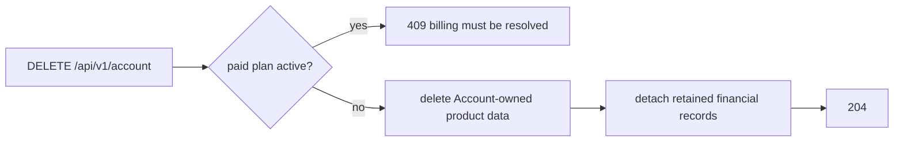

# Account Delete

`DELETE /api/v1/account` permanently deletes the Account and encrypted product
data that belongs to it.

Deletion is intentionally blocked while the Account has an active paid Plan. The
Account holder must cancel or resolve billing first, so subscription ownership
and payment obligations are not orphaned.

Deleted product data includes encrypted Conversations, Messages, key material,
Personas, Bookmarks, Library Attachments, memory, Redaction mappings, Vault
sessions, and MFA records owned by the Account.

Some records may be retained after deletion when required for billing, tax,
fraud prevention, or legal compliance. Those financial records are detached from
the deleted Account rather than keeping the Account active.

Losing the Account Key is not an account-deletion path: the Account holder can
still sign in and manage billing or delete the Account, but encrypted data is
unrecoverable without the Account Key.
