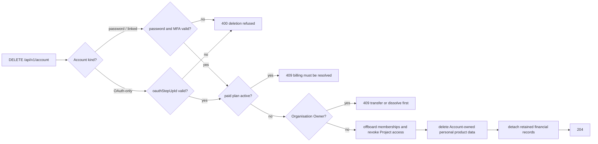

# Account Delete

`DELETE /api/v1/account` permanently deletes the Account and encrypted product
data that belongs to it.

Deletion is intentionally blocked while the Account has an active paid Plan. The
Account holder must cancel or resolve billing first, so subscription ownership
and payment obligations are not orphaned.

Organisation content is never deleted merely because the Account holder created
it. An Organisation Owner receives `409` until ownership is transferred or the
Organisation is dissolved. An ordinary member is offboarded first: membership and
Project access are revoked, and affected Projects are marked for key rotation
before the Account is erased.

Deletion is a step-up operation. A bearer token alone is never enough.

**Password Accounts** (password-only or linked): the request body must contain
the current Account password. When authenticator-app MFA is enabled, it must
also contain a current six-digit code.

**OAuth-only Accounts** (Google, no Cognos password): the Account holder types
the confirmation phrase in the UI, completes a **fresh Google sign-in**, and the
backend mints a one-time short-lived `oauthStepUpId` (same spirit as an MFA
session). `DELETE /api/v1/account` then accepts `{ oauthStepUpId }` instead of
password/TOTP. The step-up proof is consumed on use and rejected if expired or
bound to a different Account.

Deleted product data includes encrypted Conversations, Messages, key material,
Personas, Bookmarks, Library Attachments, memory, Redaction mappings, Vault
sessions, and MFA records owned by the Account. Organisation Projects and their
Conversations remain with the Organisation.

Some records may be retained after deletion when required for billing, tax,
fraud prevention, or legal compliance. Those financial records are detached from
the deleted Account rather than keeping the Account active. Organisation audit
rows the Account acted in are retained the same way: the actor link is cleared,
while action, target and time remain.

Losing the Account Key is not an account-deletion path: the Account holder can
still sign in and manage billing or delete the Account, but encrypted data is
unrecoverable without the Account Key.
