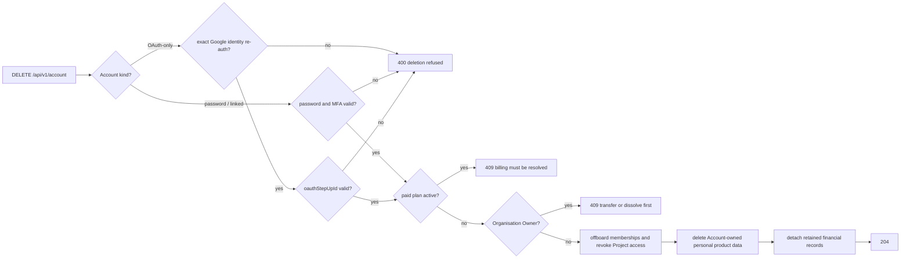

# Account Delete

`DELETE /api/v1/account` permanently deletes the Account and encrypted product
data that belongs to it.

Deletion is intentionally blocked while the Account has an active paid Plan. The
Account holder must cancel or resolve billing first, so subscription ownership
and payment obligations are not orphaned.

Organisation content is never deleted merely because the Account holder created
it. An Organisation Owner receives `409` until ownership is transferred or the
Organisation is dissolved. An ordinary member is offboarded first: membership and
Project access are revoked, and affected Projects are marked for key rotation
before the Account is erased.

Deletion is a step-up operation. A bearer token alone is never enough.

**Password Accounts** (password-only or linked — any Account with
`has_cognos_password = true`): the request body must contain the current Account
password. When authenticator-app MFA is enabled, it must also contain a current
six-digit code. Linked Accounts **must** use this path; Google re-auth cannot
substitute for password (+ MFA) on delete.

**OAuth-only Accounts** (Google linked, `has_cognos_password = false`): the
Account holder types the confirmation phrase in the UI, completes a **fresh
Google identity selection, and the backend mints a one-time short-lived `oauthStepUpId`
(TTL 5 minutes; single-use; bound to that Account). `DELETE /api/v1/account`
then accepts `{ oauthStepUpId }` instead of password/TOTP. The step-up proof is
consumed on use and rejected if expired, reused, or bound to a different
Account.

The step-up challenge is bound to the exact Google provider identity ID already
stored on that Account's live `_externalAuths` row. The OAuth callback must
return provider `google` and that same identity ID. A different Google Account,
an email match, or merely having some Google link is never enough.

OAuth-only Accounts cannot enrol Cognos MFA today (no Cognos password for enrol
step-up — see [MFA login](./mfa-login.md)). If that changes (OP-039), this delete
path must be redesigned so Cognos MFA cannot be bypassed.

Deleted product data includes encrypted Conversations, Messages, key material,
Personas, Bookmarks, Library Attachments, memory, Redaction mappings, Vault
sessions, and MFA records owned by the Account. Organisation Projects and their
Conversations remain with the Organisation.

Some records may be retained after deletion when required for billing, tax,
fraud prevention, or legal compliance. Those financial records are detached from
the deleted Account rather than keeping the Account active. Organisation audit
rows the Account acted in are retained the same way: the actor link is cleared,
while action, target and time remain.

Losing the Account Key is not an account-deletion path: the Account holder can
still sign in and manage billing or delete the Account, but encrypted data is
unrecoverable without the Account Key.

## What must never happen

- Deleting an OAuth-only Account after re-authentication with a different Google
  identity, even if its email matches.
- Accepting a provider other than `google` for OAuth step-up.
- Accepting a bearer token, unconfirmed challenge, expired/reused
  `oauthStepUpId`, or a proof bound to another Account.
- Allowing Google re-auth to replace password and Cognos MFA for a password or
  Linked Account.

## Enforcement / tests

- Password/MFA and OAuth-only delete branches:
  `backend/cmd/api/account_delete_test.go`,
  `backend/cmd/api/oauth_account_test.go`.
- Exact identity, challenge confirmation, Account binding, expiry, and single
  use: `backend/cmd/api/oauth_store_test.go`,
  `backend/cmd/api/oauth_hook_test.go`.
- API permission surface: `backend/cmd/api/auth_surface_test.go`,
  `e2e/tests/oauth-api.spec.ts`.
