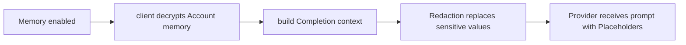

# Account Memory

**Account memory** is user-scoped context: facts, preferences, decisions, or
standing instructions the Account holder wants Cognos to remember across
Conversations.

Memory is off/on through Account preferences. When enabled, the client decrypts
the Account's memory entries and includes the relevant plaintext in the
Completion request. The server stores memory encrypted at rest and does not keep
a plaintext memory index.

Endpoints:

| Method   | Path                       | Behaviour                  |
| -------- | -------------------------- | -------------------------- |
| `GET`    | `/api/v1/user-memory`      | List Account-owned entries |
| `POST`   | `/api/v1/user-memory`      | Create encrypted entry     |
| `PATCH`  | `/api/v1/user-memory/{id}` | Update encrypted entry     |
| `DELETE` | `/api/v1/user-memory/{id}` | Delete encrypted entry     |

Redaction runs before provider dispatch. If memory contains sensitive values and
Redaction is enabled, the Provider receives Placeholders while the original
values remain in encrypted Redaction mappings.

Deleting a memory entry prevents it from being injected into future Completions.
Past Messages are not rewritten.
