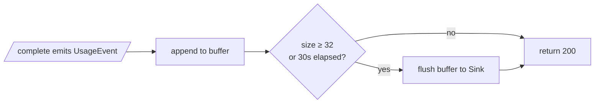

# Analytics Emit

`analytics.BufferedEmitter` is the seam every successful completion writes
through. Each emit appends a `UsageEvent` to an in-process buffer and
flushes when **either** threshold is crossed:

- `batch_size >= 32` events
- `now - last_flush >= 30s`

Flush is triggered **lazily from inside Emit**, never from a background
goroutine, so the emitter has no lifecycle to shut down. Flush errors are
logged and the buffer drained anyway: losing analytics is preferable to
blocking the request hot path on a remote sink.

Default sink in production: `analytics.LoggerSink`, which JSON-encodes each
event and writes it at `info` level through the standard `slog` logger.

`UsageEvent` by construction excludes:

- message content (no prompts, no completions)
- direct user identifiers (only the opaque `billing_user_id`)

So the structured-log sink is safe under the project's no-plaintext rule;
no separate redaction layer is needed.
