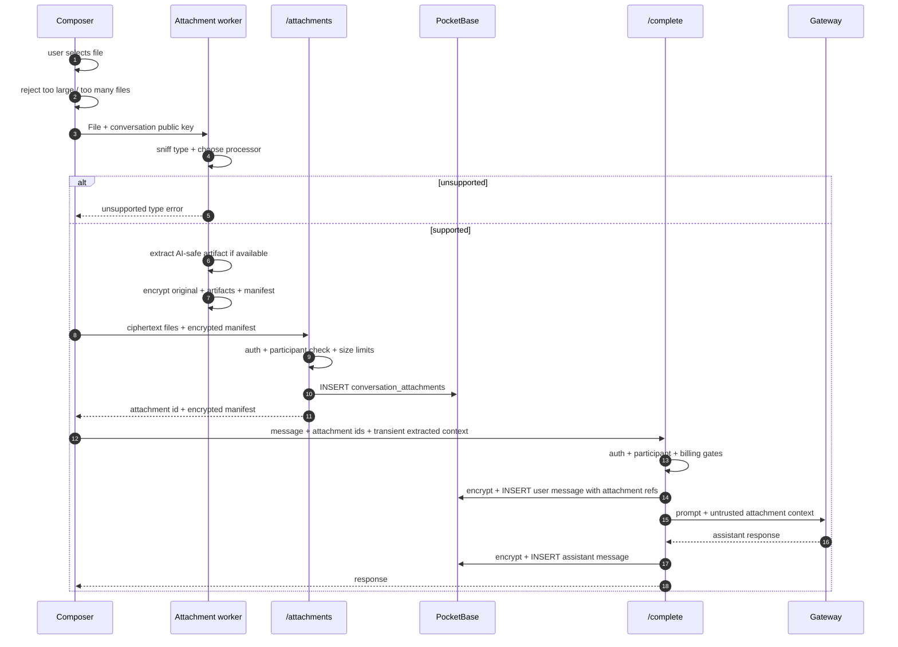

# Attachment Processing

Users can attach supported files to a chat. The browser processes and encrypts
those files **before upload**. The backend stores only ciphertext and operational
metadata needed for access control.

The same process applies to every supported attachment type: text files,
documents, images and future formats. Individual processors decide what can be
extracted for AI use; unsupported types are rejected before upload.

## Hard rules

1. **Fail closed.** Unsupported type means no upload.
2. **Encrypt before upload.** Original bytes, extracted text, thumbnails and
   manifests are encrypted in the browser.
3. **Use a worker.** File sniffing, extraction, image work, chunking and
   encryption do not run on the UI thread.
4. **Store originals.** The encrypted original file is kept even when an
   AI-ready artifact is also generated.
5. **Treat attachments as hostile.** Extracted text is untrusted prompt input;
   it must be wrapped so document instructions are not treated as system or
   developer instructions.

## What the server can see

Plaintext, by design:

- authenticated user;
- conversation id;
- attachment record id;
- ciphertext file sizes;
- upload/create timestamps;
- attachment content **only transiently** when the client includes extracted
  text or image bytes in an AI request.

Never plaintext at rest:

- original filename;
- original MIME type;
- original file bytes;
- extracted text;
- image thumbnails / downscaled images;
- attachment manifest.

## Supported processors

Each file type follows the same pipeline:

1. detect the real type from extension, MIME hint and file bytes;
2. choose a matching processor;
3. produce encrypted artifacts useful for that type;
4. reject the file if no processor supports it.

Examples of processor output:

- text/document processors extract text and optional chunks;
- image processors strip metadata and create model-sized image artifacts;
- PDF processors extract text and, where needed, page images;
- future OCR processors can add text artifacts for scanned content.

Limits still apply across all processors:

- max original file size;
- max attachments per message;
- capped extracted context sent to the model.

## Prompt-time use

The encrypted file can sit in the conversation forever without being sent to an
AI provider. The provider only sees attachment content when the user sends a
message that includes the attachment context.

The backend wraps the transient context as untrusted data before the gateway
call. The stored message contains encrypted attachment references, not plaintext
extracted content.

See the full spec: [attachments](../specs/attachments.md).
