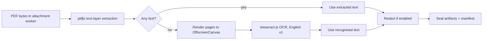

# Attachment Processing & Library

Account holders can attach supported files to a Conversation. The browser processes,
redacts and encrypts those files **before upload**, then stores them in the Account
holder's **Library** — an Account-scoped collection of files that can be reused
across any of their Conversations. The backend stores only ciphertext and operational
metadata needed for access control and "used in" tracking.

A file belongs to the **Account**, not a Conversation: its per-artifact keys and its
manifest are sealed to the Account holder's personal Vault key, so the owner can
decrypt it anywhere. A Conversation only _references_ a Library file through a Message.
(Future: project libraries seal to a project key so a team can share files.)

The same process applies to every supported type: text files, documents, images
and future formats. Individual processors decide what can be extracted for AI
use; unsupported types are rejected before upload.

```mermaid
sequenceDiagram
  autonumber
  participant UI as Composer
  participant W as Attachment worker
  participant API as /api/v1/attachments
  participant DB as PocketBase
  participant C as /complete
  participant GW as Gateway

  UI->>UI: Account holder picks Upload or From library
  alt Upload (new file)
    UI->>UI: reject too large / too many; dedupe by content hash
    UI->>W: File + user (vault) public key + redact?
    W->>W: sniff type + choose processor
    alt unsupported
      W-->>UI: unsupported type error
    else supported
      W->>W: extract AI-safe artifact if available
      W->>W: redact extracted text → tokens + mappings (if redaction on)
      W->>W: encrypt original + artifacts + manifest (sealed to Account key)
      UI->>API: POST ciphertext files + sealed manifest
      API->>API: auth + owner + size/quota limits
      API->>DB: INSERT user_attachments (owner-scoped)
      API-->>UI: attachment id + sealed manifest
    end
  else From library
    UI->>API: GET /attachments (list)
    UI->>UI: decrypt manifests, pick file(s)
    UI->>API: GET artifact bytes → decrypt → re-derive redacted context
  end
  UI->>C: message + attachment ids + transient redacted context + redaction mappings
  C->>C: auth + participant + owns-attachments + billing gates
  C->>DB: encrypt + INSERT user message with attachment refs
  C->>DB: INSERT attachment_usages (attachment, conversation, message)
  C->>GW: prompt + untrusted (already-redacted) attachment context
  GW-->>C: assistant response
  C->>DB: encrypt + INSERT assistant message
  C-->>UI: response (placeholders hydrate on display)
```

## Hard rules

1. **Fail closed.** Unsupported type means no upload.
2. **Seal to the Account.** Original bytes, extracted text, image artifacts and the
   manifest are encrypted in the browser and sealed to the Account holder's Vault key —
   not the Conversation key — so files are reusable and owner-only.
3. **Use a worker.** Sniffing, extraction, image work, redaction and encryption
   do not run on the UI thread.
4. **Redact as early as possible.** When redaction is on, detected sensitive
   values in the extracted text are tokenised in the worker, before the file is
   sealed; the provider never sees raw values. The mappings travel in the manifest.
5. **Store originals.** The encrypted original file is kept even when an AI-ready
   artifact is also generated.
6. **Treat attachments as hostile.** Extracted text is untrusted prompt input; the
   backend wraps it so document instructions are not treated as system/developer
   instructions.
7. **Removal tombstones, never cascades.** Deleting a library file removes its
   bytes and usage rows but leaves the referencing messages intact — they render a
   "File removed" cue.

## Redaction travels with the file

Redaction mappings are minted once, at processing, and stored (sealed) in the
manifest, so a reused library file keeps **stable** placeholders. When the file is
used in a conversation, those mappings are merged into that conversation's
redaction scope (`source_kind: 'attachment'`) and behave like any other redaction
entry — they hydrate the assistant's reply for anyone who can open the
conversation's redaction key. The provider only ever receives placeholders, even
on reuse. (See `docs/specs/pii-redaction.md` §6.8.)

## Per-viewer visibility

Because a file is sealed to its owner, what a viewer sees in a message bubble
depends on who they are:

- **Owner** → the file chip shows the name and downloads on click (decrypted
  client-side from the manifest).
- **Owner, file deleted** → "File removed" tombstone.
- **Co-participant or Public share viewer** → "Private file attached" — they
  cannot decrypt another Account holder's file. The state is decided from the Message
  sender's identity, never by probing the backend (which 404s either way), so a
  filename never leaks. Project-scoped (shared-decryptable) files are a later step.

## What the server can see

Plaintext, by design:

- authenticated Account holder (the file owner);
- ciphertext file sizes and upload/update timestamps;
- `attachment_usages` rows: which (conversation, message) reference a file —
  powers "used in chats" and the tombstone;
- attachment content **only transiently** when the client includes (already
  redacted) extracted text or image bytes in an AI request.

Never plaintext at rest:

- original filename, MIME type, file bytes;
- extracted text, image artifacts;
- redaction originals/mappings;
- the attachment manifest;
- the content hash — the blake2b plaintext hash used for dedup lives **inside the
  sealed manifest**, never as a plaintext column. A plaintext content hash would
  enable confirmation-of-file attacks, so dedup is performed client-side after the
  owner decrypts their own library.

## The library

- **List / search** — the library page (`/account/library`) and the composer
  "From library" picker list the Account holder's files; names are decrypted client-side,
  so search is client-side.
- **Reuse** — attaching from the library references an existing file (no second
  upload); its redacted text context is re-derived client-side from the decrypted
  artifact + stored mappings.
- **Dedup** — re-uploading identical bytes (matched by the manifest's blake2b
  plaintext hash) reuses the existing library entry instead of storing a duplicate.
- **Rename** — the display name lives in the manifest; renaming re-seals and PATCHes
  the manifest only.
- **Remove** — allowed anytime; tombstones referencing chats (see Hard rules).

## Prompt-time use

A library file can sit unused forever without reaching a provider. The provider
only sees attachment content when the Account holder sends a Message that includes it. The
backend wraps the transient (redacted) context as untrusted data, meters it in the
billing gate, and persists only encrypted attachment references — never plaintext
extracted content.

Limits still apply across all processors: max original file size, max attachments
per Message, capped extracted context, and a per-Account storage quota.

## PDF OCR fallback

PDF processing has a fast path and a fallback path:



OCR only runs when the normal pdfjs text-layer pass returns no text. That keeps
the common path fast and avoids paying OCR cost for ordinary PDFs. When needed,
the attachment worker renders each page to an `OffscreenCanvas`, runs
`tesseract.js` locally, joins the recognised page text, then continues through
the same redaction, sealing and prompt-context flow as any other extracted text.

The OCR worker, core wasm and English trained data are served from
`/assets/tesseract` and loaded lazily. No page image or recognised text is sent
to a third-party OCR service.

OCR invariants:

1. **Client-side only.** OCR happens inside the browser attachment worker.
2. **Fallback only.** A PDF with a usable text layer never goes through OCR.
3. **Same privacy path.** Recognised text is redacted before prompt use when
   redaction is enabled, and sealed before upload.
4. **English v1.** The first implementation recognises English only.

## Security summary & related processes

- **Encryption scope** — per-file keys + manifest sealed to the owner's vault key;
  owner-only, reusable across chats. Co-participants/public viewers can't decrypt
  ("private file attached"). See [participant-access-control](./participant-access-control.md)
  and [conversation-key-rotation](./conversation-key-rotation.md) (library files are
  Account-keyed, so rotation doesn't reach them).
- **Redaction** — detected values are tokenised in the worker before upload; the
  provider only ever sees placeholders, even on reuse. See
  [pii-redaction spec](../specs/pii-redaction.md) §6.8.
- **Prompt injection** — attachment text is wrapped as untrusted content server-side
  (see [completion-pipeline](./completion-pipeline.md)).
- **Lifecycle** — a referenced file survives message expiry/deletion
  ([expired-message-cleanup](./expired-message-cleanup.md)); removal tombstones
  referencing chats and **erases immediately** — `user_attachments` is excluded
  from soft-delete retention so the sealed manifest isn't snapshotted
  ([soft-delete-retention](./soft-delete-retention.md)).
- **Full threat model**: [docs/specs/attachments.md](../specs/attachments.md).
