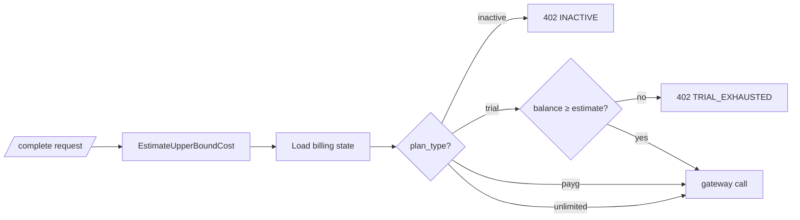

# Billing Access Gate

Before the gateway is called, `billing.Service.EvaluateAccess(state, estimate)`
decides whether the Account holder is allowed to spend on this request. The
**estimate** is the upper-bound cost for the Model (full input context ×
`max_output_tokens`, with margin and FX applied).

| `plan_type` | Decision                                                                                    |
| ----------- | ------------------------------------------------------------------------------------------- |
| `inactive`  | **Block** — `402 INACTIVE`, message `"Choose a plan to keep chatting."`                     |
| `trial`     | **Block if** `balance_rappen < estimate_rappen` — `402 TRIAL_EXHAUSTED` with balance + cost |
| `payg`      | Pass — usage will be metered post-paid via Paddle (see [billing spec](../specs/billing.md)) |
| `unlimited` | Pass — flat-rate plan, no per-request gating                                                |

Why the upper bound, not a point estimate: the gate runs before the actual
Provider call, so the only safe budgeting unit is "the maximum this request
could possibly cost." Anything looser risks letting a trial Account run
slightly negative.

The actual cost (post-gateway) is recorded by the
[usage-ledger](./usage-ledger.md) step and may be smaller than the estimate
— the difference is not refunded, it stays in the Account's balance.
