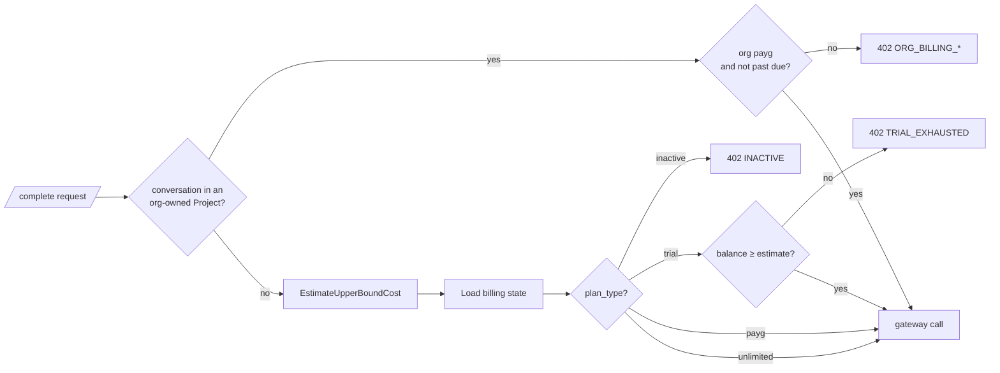

# Billing Access Gate

Before the gateway is called, the billing **subject** is resolved from the
conversation's scope (`billing.ResolveState`: conversation → Project →
Organisation). A conversation in an org-owned Project bills the
**Organisation** — regardless of who types; everything else bills the caller
**personally**. Then `EvaluateOrgAccess` (org subjects) and
`EvaluateAccess(state, estimate)` decide whether the request may spend. The
**estimate** is the upper-bound cost for the Model (full input context ×
`max_output_tokens`, with margin and FX applied).

| Subject  | State                            | Decision                                                                                      |
| -------- | -------------------------------- | --------------------------------------------------------------------------------------------- |
| Personal | `inactive`                       | **Block** — `402 INACTIVE`, message `"Choose a plan to keep chatting."`                       |
| Personal | `trial`                          | **Block if** `balance_rappen < estimate_rappen` — `402 TRIAL_EXHAUSTED` with balance + cost   |
| Personal | `payg`                           | Pass — usage is metered post-paid through Paddle                                              |
| Personal | `unlimited`                      | Pass — flat-rate plan, no per-request gating                                                  |
| Org      | `payg`, not past due             | Pass — usage accrues to the org's pooled cycle (ledger row: `organisation` + acting user)     |
| Org      | missing `org_billing` / not payg | **Block** — `402 ORG_BILLING_INACTIVE`; **never** falls back to the member's personal balance |
| Org      | `payg` + `past_due`              | **Block** — `402 ORG_BILLING_PAST_DUE`; org Projects are read-only until dunning resolves     |

`ORG_*` responses carry `organisation_id`/`organisation_name`, a neutral
member `message` and the actionable `admin_message` (one step, e.g. update the
payment method).

Why the upper bound, not a point estimate: the gate runs before the actual
Provider call, so the only safe budgeting unit is "the maximum this request
could possibly cost." Anything looser risks letting a trial Account run
slightly negative.

The actual cost (post-gateway) is recorded by the
[usage-ledger](./usage-ledger.md) step and may be smaller than the estimate
— the difference is not refunded, it stays in the Account's balance.
