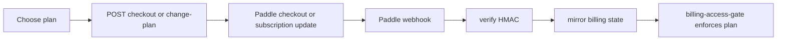

# Billing Plan Management

The Account holder chooses or changes a **Plan** in Cognos. Payment collection,
subscription state, invoices, and the customer portal are delegated to Paddle;
Cognos mirrors the resulting state for access control and in-app display.

Customer-facing endpoints:

| Method | Path                                | Behaviour                       |
| ------ | ----------------------------------- | ------------------------------- |
| `GET`  | `/api/v1/billing`                   | Current Plan and subscription   |
| `GET`  | `/api/v1/billing/usage`             | Usage summary                   |
| `POST` | `/api/v1/billing/checkout`          | Start Paddle checkout           |
| `POST` | `/api/v1/billing/change-plan`       | Change an existing subscription |
| `POST` | `/api/v1/billing/cancel`            | Cancel at Paddle                |
| `POST` | `/api/v1/billing/resume`            | Resume a cancelled subscription |
| `POST` | `/api/v1/billing/portal`            | Open Paddle customer portal     |
| `GET`  | `/api/v1/billing/invoices`          | List invoices                   |
| `GET`  | `/api/v1/billing/invoices/{id}/pdf` | Fetch invoice PDF link          |

The unauthenticated `/webhooks/paddle` route is gated by HMAC signature
verification and is not rate-limited, so Paddle retries are not dropped.

If Paddle is unavailable, existing mirrored billing state continues to gate
Completions. New checkout, portal, invoice, or plan-change actions may show a
temporary billing error until Paddle is reachable again.
