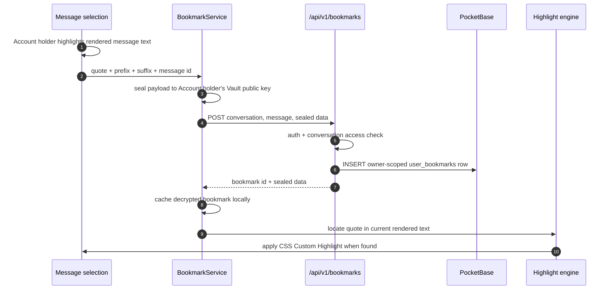
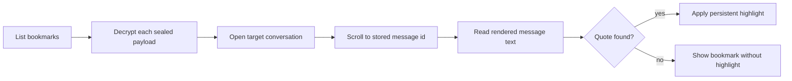

# Bookmarks

Bookmarks let an Account holder highlight text in a Message, save that span,
browse it from `/account/bookmarks`, then jump back to the original Message with
the same span highlighted again. The selected text is Conversation content, so
Cognos treats it like private data: the browser seals the bookmark payload to the
Account holder's Vault key before the backend sees it.

The backend only stores the owner, conversation id, message id and opaque
bookmark data. The quote, surrounding context and optional note are never
plaintext at rest.

## Re-anchoring

A bookmark stores a text-quote-with-context selector:

- `quote` — the exact selected text.
- `prefix` — up to 32 characters before the quote.
- `suffix` — up to 32 characters after the quote.

The client does **not** store rendered DOM offsets. Messages are rendered from
markdown and may include redaction pills, citations and hydrated/dehydrated
content. Numeric offsets would drift. On load, the client searches the rendered
plain text for the quote and uses the prefix/suffix to pick the right occurrence
when the same text appears more than once.

## Invariants

1. **Bookmark text is client-encrypted.** The quote, context and note live inside
   a sealed payload. The server stores opaque base64 in `user_bookmarks.data`.
2. **Access is checked before create.** An Account holder can only create a Bookmark
   for a Conversation they can access. Missing and inaccessible Conversations both
   return a neutral `404`.
3. **Listing and deletion are owner-only.** Account holders only see their own
   Bookmarks; deleting a foreign or missing Bookmark returns the same neutral `404`.
4. **A failed re-anchor never guesses.** If the quote no longer appears, the UI
   does not highlight a nearby or unrelated span.
5. **Bookmarks are not Participants.** The row is Account-scoped and only
   links to Conversation/Message ids so the client can jump back.

## Not yet wired

- Bookmark payloads have room for `note`, but the current capture flow does not
  expose note editing.
- Co-participants do not share Bookmarks. A Bookmark belongs to the Account holder
  who saved it, even when the underlying Conversation is shared.
