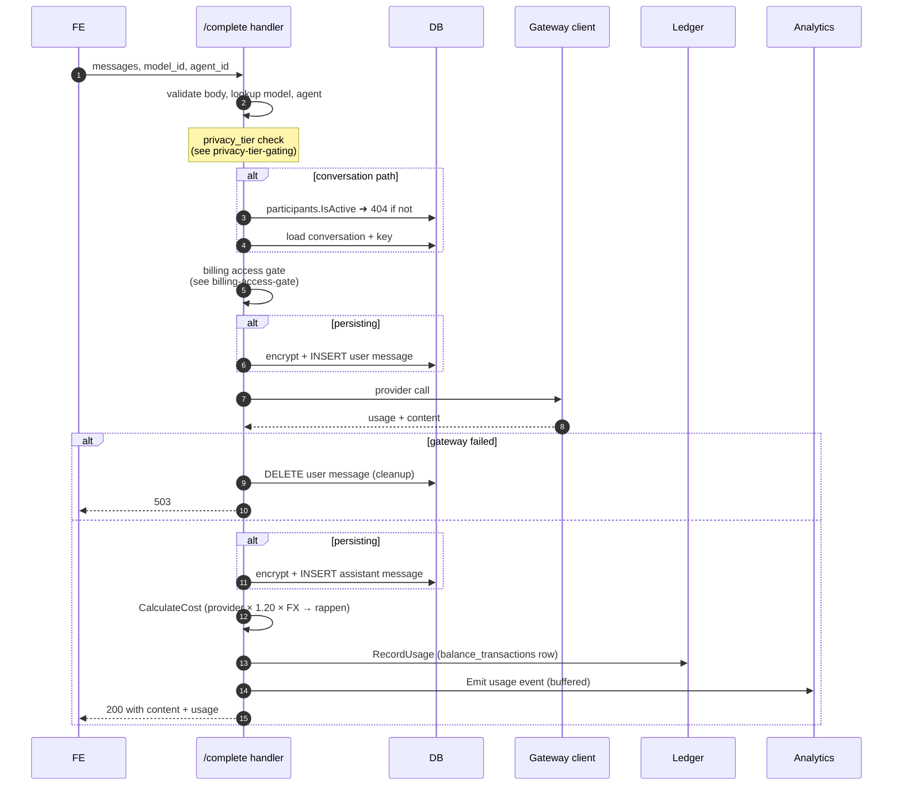

# Completion Pipeline

`POST /api/v1/completions` (free) and
`POST /api/v1/conversations/{id}/complete` (persisting) run the same
sequence. The persisting path adds the participant check and writes user +
assistant messages around the gateway call.

Three invariants the handler holds across that flow:

1. **No paid gateway call without authorisation.** Participants check and
   billing gate both run before the upstream provider is touched. A
   non-participant or unfunded user sees `404` / `402` respectively, with
   zero provider cost.
2. **No orphan user message.** If the gateway call fails after the user
   message is persisted, the handler deletes that message before
   returning `503` so the conversation never carries an unanswered prompt.
3. **Best-effort billing + analytics.** Ledger and analytics writes happen
   after the success response is computed; failures are logged but do not
   fail the request — the user has already received the answer they paid
   for, and re-running cost arithmetic from existing artefacts is possible.
