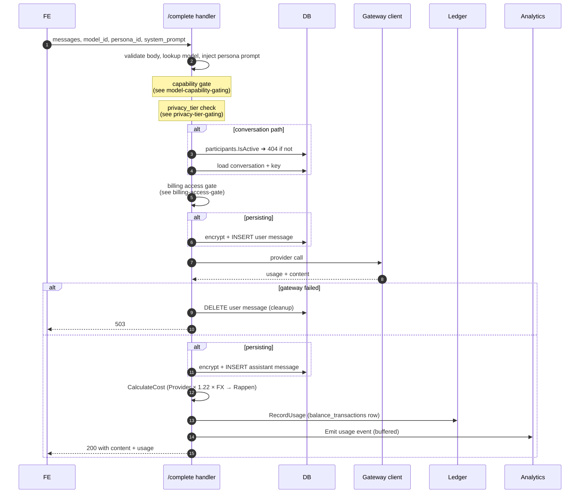

# Completion Pipeline

`POST /api/v1/completions` (free) and
`POST /api/v1/conversations/{id}/complete` (persisting) run the same
sequence. The persisting path adds the participant check and writes user +
assistant messages around the gateway call.

Three invariants the handler holds across that flow:

1. **No paid gateway call without authorisation.** Participants check and
   billing gate both run before the upstream Provider is touched. A
   non-participant or unfunded Account holder sees `404` / `402` respectively,
   with zero Provider cost.
2. **No orphan user message.** If the gateway call fails after the user
   message is persisted, the handler deletes that message before
   returning `503` so the Conversation never carries an unanswered prompt.
3. **Best-effort billing + analytics.** Ledger and analytics writes happen
   after the success response is computed; failures are logged but do not
   fail the request — the Account holder has already received the answer they
   paid for, and re-running cost arithmetic from existing artefacts is possible.

## Attachments

When a completion references library files (`attachment_ids` /
`attachment_contexts`), the handler:

- **verifies the caller _owns_ each referenced file** (`user_attachments.owner ==
  caller`) before the gateway call — a pre-provider authorisation gate alongside
  the participant and billing checks; a foreign id is `400` with zero provider cost;
- wraps the (already client-redacted) attachment text as **untrusted** content,
  appends it to the user turn, and counts it in the billing-gate token estimate so
  large attachments can't bypass the gate;
- on the persisting path, embeds `user_upload` references inside the **encrypted**
  user message and records an `attachment_usages` row per `(file, message)` — it
  never persists the plaintext attachment context;
- re-sends context for attachments referenced earlier in the thread (excluding any
  folded into a compaction summary) so a stateless model keeps seeing them.

Full lifecycle, encryption scope and security: [attachment-processing](./attachment-processing.md).
