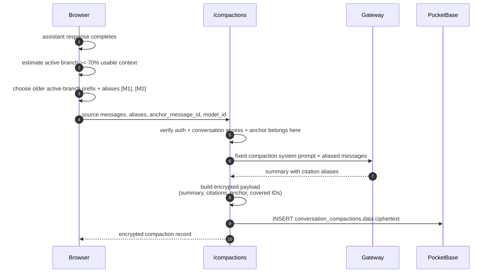

# Conversation Compaction

Cognos compacts old context **in the background** so long Conversations keep working
when the selected Model's context window fills up.

V1 is transparent to Account holders:

- no modal;
- no blocking spinner;
- no manual “summarise” button;
- future power-user mode can show what was compacted.

The browser still owns the decision: it decrypts the active branch, estimates
context size, chooses the older prefix to compact, and later decides whether a
stored compaction applies to the active branch.

The backend owns the compaction prompt: a dedicated endpoint adds the fixed
system prompt, calls the provider, encrypts the summary with the conversation
public key, and stores only ciphertext.



## The stored record

`conversation_compactions` has only routing/access metadata in plaintext:

```txt
id, conversation, data, created, updated
```

Everything about the compaction is encrypted inside `data`:

- summary;
- anchor message ID;
- covered message IDs;
- citation alias → message ID map;
- model ID;
- token estimates;
- prompt version.

The server must never persist plaintext compaction text.

## How context uses it

If the active branch is:

```txt
m1, m2, m3, m4, m5, m6, m7, m8
```

and an encrypted compaction is anchored at `m5`, future sends use:

```txt
summary(m1..m5) + m6 + m7 + m8 + new user message
```

Rules:

- use only compactions whose anchor is on the active branch;
- never use a compaction from a sibling branch;
- do not also send raw messages covered by the summary;
- if no valid compaction exists, fall back to raw-tail truncation.

## Citation rule

The provider sees aliases, not database IDs:

```txt
[M1] user: ...
[M2] assistant: ...
```

The encrypted payload stores the real mapping, so future UI can link `[M1]` to
the original message after client-side decryption.

## Background rule

Trigger after a successful assistant response when estimated context reaches
about **70%** of usable context.

Compaction must not block chat:

- one in-flight compaction per conversation;
- if the Account holder sends while compaction runs, send normally;
- use the compaction on later sends once it exists;
- failures are silent to the Account holder and retried later.

## Retention rule

Do **not** create V1 compactions for:

- Temporary conversations;
- Conversations with Disappearing messages.

A persisted summary could otherwise outlive content the Account holder expected to vanish.

## Deletion rule

If an Account holder deletes a Message, delete or invalidate every compaction covering
that Message. Because covered IDs are encrypted, the browser must identify affected
compactions after decryption and ask the backend to delete them.

Hard invariant:

> Deleted message content must not survive inside a compaction summary.

See the full spec:
[client-side-compaction](../specs/client-side-compaction.md).
