# Conversation Copy

User-facing label: **Duplicate chat**.

This is a chat-level action from the sidebar menu or conversation detail menu.
It is **not** the same as editing/regenerating a message, which creates a
branch inside the same conversation.

**v1 scope (2026-06-24):** standalone conversations only, PII redaction copied.
The action is **disabled/blocked** when the source has attachments or belongs
to a project (both deferred — never copied partially). Copy is one synchronous,
all-or-nothing request capped at 500 messages. Full detail and the deferred-work
list live in the [spec §0.0](../specs/conversation-copy.md).

A duplicate is a new conversation with a new keypair. Because message rows are
sealed to the source conversation public key, the browser must decrypt and
re-encrypt every copied payload before the backend stores it. If the source has
PII redaction, the browser also creates a fresh redaction keypair, copies the
same placeholder-token map, and re-encrypts each original value under the
duplicate redaction key.

```mermaid
flowchart LR
  A[User clicks Duplicate chat] --> B[Browser loads source keys + all messages]
  B --> C[Generate duplicate keypair + new ids]
  C --> D[Decrypt source metadata/messages locally]
  D --> E[Rewrite conversation_id + parent_message_id]
  E --> F[Encrypt payloads to duplicate public key]
  F --> G[POST duplicate ciphertext bundle]
  G --> H[Backend validates access + graph]
  H --> I[BEGIN]
  I --> J[INSERT duplicate conversation + keys]
  J --> K[INSERT copied messages with remapped parents]
  K --> L[COMMIT]
```

Rules:

- Copy **all** source messages, including sibling branches and tombstones.
- Generate duplicate conversation/message IDs before encryption, then remap
  every `parent_message` to the copied parent message ID.
- If any generated ID conflicts, the backend returns `409` and writes nothing;
  the browser must regenerate the whole encrypted bundle before retrying.
- Update encrypted binding fields too: copied message blobs must refer to the
  duplicate `conversation_id` and copied `parent_message_id`.
- If the source is in a project, create the duplicate in the **same project**.
- If the source is standalone, create only one participant on the duplicate:
  the copying user as `Admin`.
- Copy PII redaction mappings with a fresh duplicate redaction keypair when
  the source has redaction material.
- Never copy `conversation_public_shares`; the duplicate starts unshared.
- Never send plaintext title, message, reasoning, redaction original, or
  attachment plaintext to the backend.

Why re-encryption is required: existing message `data` is
`SealAnonymous(message_json, source_conversation_public_key)`. A fresh duplicate
keypair cannot open that ciphertext. Reusing old ciphertext would create a
conversation whose messages cannot decrypt.

Project nuance: project conversations do not use conversation participants.
The duplicate conversation secret key is wrapped by the current project content
key and stored in `project_conversation_keys`. A project `Viewer` can read but
cannot duplicate, because duplicating creates project content.

Public/share nuance: copying a publicly shared chat does **not** copy the public
URL, token, share key, or wrapped share secret. Authenticated standalone
participants are not copied either; the duplicate is private to the copier.

Failure rule: the duplicate write must be transactional. If ID validation, key
creation, message graph validation, attachment copying, or redaction copying
fails, nothing is persisted. This avoids half-created conversations with missing
keys, partial message trees, or missing PII maps.

UX rule: duplicating may take time because encryption happens in the browser.
Show a blocking loading state that tells the user to keep the tab open and not
reload until the duplicate completes. All labels, warnings, toasts, and errors
must be translated in English, German, French, Spanish, Portuguese, and Italian.

See the full product/architecture spec:
[conversation-copy](../specs/conversation-copy.md).
