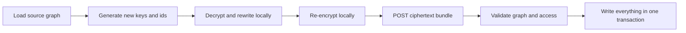

# Conversation Copy

User-facing label: **Duplicate chat**.

Duplicate chat supports standalone Conversations with at most 500 Messages. It rejects Project
Conversations and any source containing Attachments; neither case is copied partially.

The browser generates a fresh Conversation key pair and new Message IDs, decrypts each source
payload, rewrites Conversation and parent IDs, then re-encrypts everything for the new key.
Redaction mappings use a fresh Redaction key. Plaintext never reaches the backend.

Rules:

- Copy all source Messages, including sibling branches and tombstones.
- Preserve parent relationships using the new IDs.
- Copy Redaction mappings with a fresh Redaction key.
- Create only the copying Account holder as an Admin Participant.
- Never copy Participants, Public shares, URLs or share keys.
- Return `409` without writes when any generated ID already exists.
- Roll back the entire duplicate when validation or any write fails.

Copying can take time because encryption happens in the browser. The UI keeps a blocking,
translated progress state until the transaction finishes.

Project, Attachment and larger-copy support is outside the current scope. Reconsider it only with
evidence that the fail-closed limit blocks real use.
