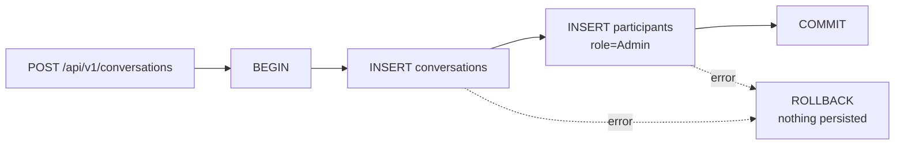

# Conversation Create

`POST /api/v1/conversations` writes **two** rows inside a single
`app.RunInTransaction`:

1. The `conversations` row (`creator`, `data`, `expiry_duration`,
   `key_version = 1`).
2. A `participants` row binding the creator to the new conversation with
   `role = "Admin"` and `added_at = now()`.

Why a transaction: pre-tx code tried to compensate by deleting the
conversation on participant-insert failure. A second failure inside the
compensating delete would have left an orphan conversation with no
participant — a row no one could ever read because
[participant-access-control](./participant-access-control.md) gates **all**
access on participant membership. Atomic write removes that case entirely.
