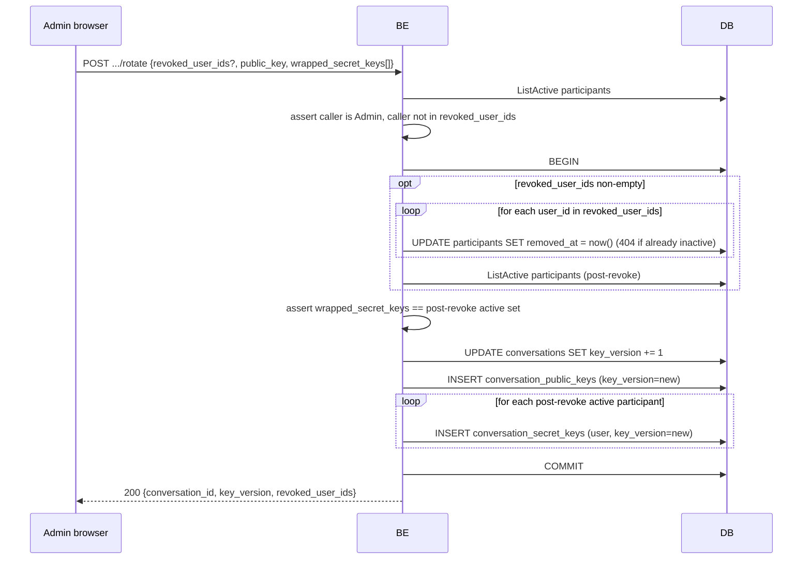

# Conversation Key Rotation

`POST /api/v1/conversations/{id}/rotate` cycles the conversation's
encryption key. It is the **only** way to remove a participant or to lock
out a revoked participant from **future** messages, since previously-wrapped
secret keys they hold remain cryptographically valid against the old
generation.

Caller must be an `Admin` participant. Body carries:

- `revoked_user_ids[]` — **optional**. Zero or more currently-active
  participants to soft-revoke as the first step of the same transaction.
  Empty / omitted = pure rotation (e.g. periodic refresh, suspected
  compromise of the conversation key, never a membership change).
- A new conversation `public_key` (+ optional signature).
- `wrapped_secret_keys[]` — one entry per **post-revoke** active
  participant, each carrying the new secret key wrapped for that user's
  public key.

Guards:

- Caller must be `Admin` (`403` otherwise).
- Caller cannot be in `revoked_user_ids` (`400`). Self-leave is intentionally
  blocked here because the Admin-only path can't tell whether the caller is
  the last Admin without extra reads; a future "leave conversation" UX
  must enforce the last-Admin invariant separately.
- Every id in `revoked_user_ids` must currently be active (`404` via
  `ErrParticipantNotFound` otherwise; nothing written).
- `wrapped_secret_keys[]` must **exactly equal** the set of participants
  who remain active after the revocation step. Missing user → rejected.
  Extra user → rejected. Duplicate user → rejected.

Why both steps in one transaction: a revoke-then-rotate dance leaves a
window where the revoked user is "removed" but new messages still use the
old key — which they can still decrypt with the wrapped secret they
already hold. Bundling them closes the gap: no other request observes the
half-revoked / pre-rotated state.

Why exact-match on `wrapped_secret_keys`: a missing entry would lock a
remaining participant out of the new generation on the next message. An
extra entry would issue a key to someone who shouldn't have one. The
handler refuses to make either mistake — the client must compute the
wrappings deliberately against the post-revoke active set.

## Revocation semantics

When `revoked_user_ids` is non-empty, the matching `participants` rows are
soft-updated with `removed_at = now()`. The historical row is **kept**:
it's the audit trail of "who was once allowed".

Revocation removes access **immediately** for new reads (see
[participant-access-control](./participant-access-control.md)). Existing
wrapped secret keys held by the revoked user remain valid for the data
they've already pulled — that's exactly what the rotation step in this
same transaction handles: by bumping `key_version`, the revoked user has
no `conversation_secret_keys` row at the new generation and therefore
cannot decrypt any future message.

Read paths automatically pick up the new generation — see
[key-version-read-gate](./key-version-read-gate.md). Old-generation rows
stay in the DB as audit data but never surface through the API.

## Bulk revocation

`revoked_user_ids` is a list, so a single call can remove 1 or N users.
Each removal happens inside the same transaction as the rotation, so a
bulk revoke is atomic: either every named user is removed and the key is
rotated, or nothing changes.
