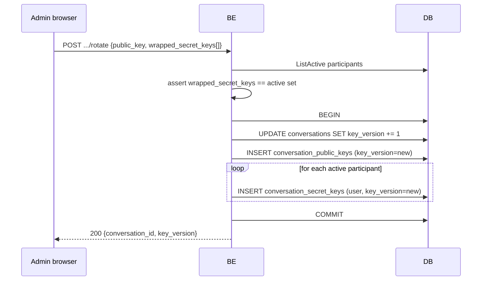

# Conversation Key Rotation

`POST /api/v1/conversations/{id}/rotate` cycles the conversation's
encryption key. It is the only way to lock out a revoked participant from
**future** messages, since previously-wrapped secret keys they hold remain
cryptographically valid against the old generation.

Caller must be an `Admin` participant. Body carries:

- A new conversation `public_key` (+ optional signature).
- `wrapped_secret_keys[]` — one entry per **currently active** participant,
  each carrying the new secret key wrapped for that user's public key.

The handler enforces a strict invariant before writing anything: the set of
user IDs in `wrapped_secret_keys` must **exactly equal** the set of active
participants. Missing user → rejected. Extra user → rejected. Duplicate
user → rejected.

Why exact-match: a missing entry would lock a current participant out of
the new generation on the next message. An extra entry would issue a key
to someone who shouldn't have one. The handler refuses to make either
mistake — the client must compute the wrappings deliberately.

Read paths automatically pick up the new generation — see
[key-version-read-gate](./key-version-read-gate.md). Old-generation rows
stay in the DB as audit data but never surface through the API.
