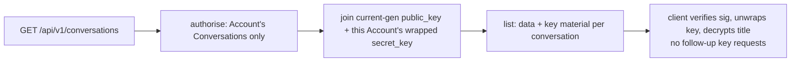

# Conversation Load

The sidebar must decrypt every conversation's title to render it, which needs that conversation's
keypair. The **rule**: the keys travel **with the list**, not as follow-up requests.

`GET /api/v1/conversations` returns, per conversation, the encrypted `data` **and** the current
key material the requesting Account holder needs to decrypt it:

- `public_key` + `public_key_signature` (current generation);
- `wrapped_secret_key` wrapped for **this Account only**, at the Conversation's current
  `key_version`.

This mirrors the project-conversation list, which already embeds
`wrapped_conversation_secret_key`. The standalone per-conversation `GET …/public-key` and
`GET …/secret-key` endpoints stay for writes, rotation, copy/share, and as a fallback when the list
omits a conversation's keys — but they are **off the bulk load path**.

Why: fetching keys per-conversation turned one load into `~4N` requests (a public-key GET, a
secret-key GET, and a CORS preflight each). One batched read is the invariant.

## Rules

- The list embeds only the **requesting Account's** wrapped secret key — never another
  Participant's.
- Only the Conversation's **current** `key_version` material is embedded (see
  [key-version-read-gate](./key-version-read-gate.md)); stale generations stay invisible.
- A Conversation missing current-generation keys omits its key fields; the client falls back to the
  per-conversation endpoints for that one rather than failing the whole list.
- Embedding adds no rows the Account holder could not already read; it must not widen access.

See:

- [key-version-read-gate](./key-version-read-gate.md)
- [encrypted response caching review](../open-points.md#conversations-and-retrieval)
