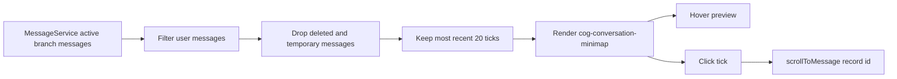
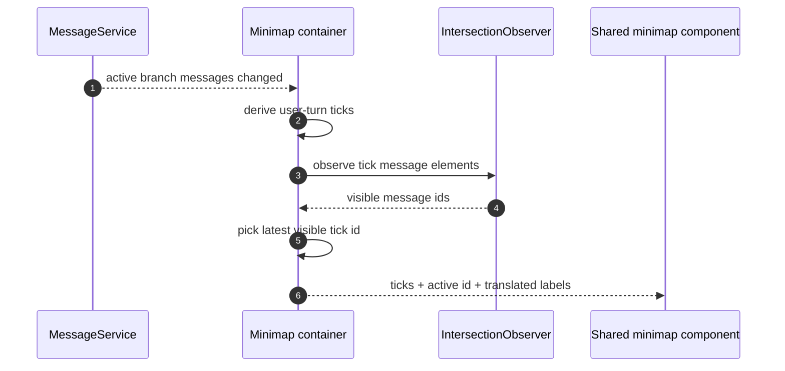

# Conversation Minimap

The conversation minimap is a desktop right rail for long chats. It shows one
tick per user turn in the **currently active branch**, lets the user preview the
turn on hover, and jumps back to that message when clicked.

It is navigation only: it does not change branch state, message content or
server data.

## Active tick

The app container watches rendered message elements with `IntersectionObserver`.
When multiple ticked messages are visible, the most recent visible user turn is
marked active. When the branch changes, the derived ticks change, the observer is
rebuilt, and the rail reflects the new active branch.

## Invariants

1. **Branch-aware by construction.** Ticks are derived from
   `MessageService.messages()`, which is already the active branch, not from all
   sibling messages in the conversation.
2. **Only user turns are indexed.** Assistant turns are excluded because the rail
   is for finding the user's questions and instructions.
3. **Only persisted messages can be jumped to.** Temporary or still-streaming
   messages without a record id are skipped.
4. **Deleted messages are skipped.** A tombstoned user turn must not remain as a
   jump target.
5. **The library component stays presentational.** The app layer owns message
   derivation, active tracking and localisation; `@cognos/ui-angular` only
   renders labelled ticks and emits jump ids.

## Not yet wired

- The minimap is desktop-only and hidden for one or zero ticks.
- It indexes at most the most recent 20 user turns; there is no pagination or
  compressed overview for very long chats yet.
