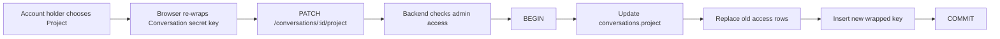

# Conversation Project Membership

User-facing labels: **Move to project** and **Remove from project**.

A Conversation is either:

- **standalone**: access comes from Conversation Participants;
- **inside a Project**: access comes from project participants.

Moving a Conversation changes who can read it, so the backend updates the
Conversation row and key wrapping rows in one transaction.

Rules:

- Moving a standalone Conversation into a Project requires Conversation
  **Admin** and target Project **Admin**.
- Moving between Projects requires **Admin** on the source and target Projects.
- Removing from a Project requires source Project **Admin**.
- Removing creates one standalone Participant: the caller, as **Admin**.
- The browser re-wraps the existing Conversation secret key. Plaintext never
  reaches the backend.
- A Project Conversation has no Conversation Participant rows.
- If any row fails to write, the transaction rolls back and nothing changes.

Why this matters: a half-moved Conversation is dangerous. It could appear in a
Project without a usable Project key, or keep old standalone Participants after
being moved into a shared workspace. Atomic writes prevent both.
