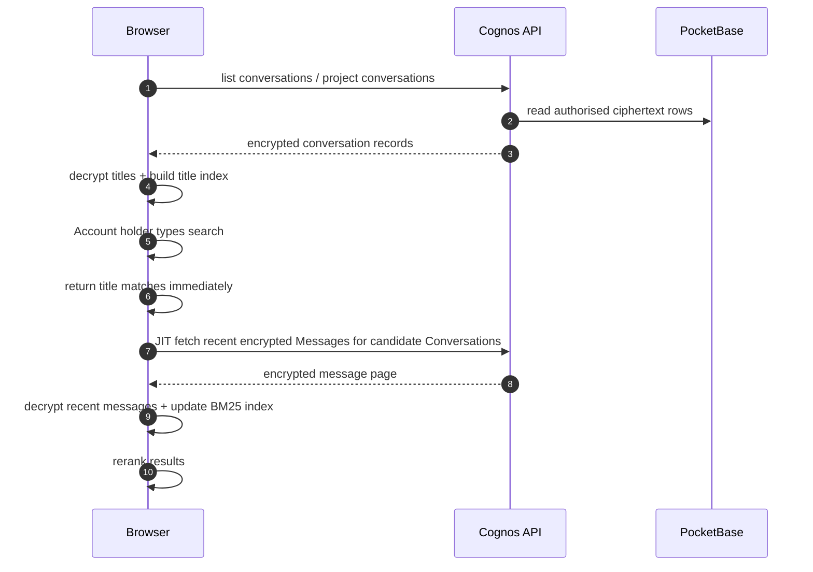

# Conversation Search Index

Sidebar search is **on-device**.

The server returns the same encrypted Conversations and Messages it already does. The browser
decrypts what the signed-in Account holder can access, builds a temporary Orama BM25 index, and
throws it away when the Vault locks or the Account holder logs out.



## Rules

- Index **titles immediately** after conversation decryption.
- Index **recent Messages lazily** when the Account holder searches or the browser is idle.
- Index Conversation **title + message content only**.
- Search runs after a **3-character minimum** and a **400 ms debounce**; it requires **all** query
  terms (BM25 `threshold: 0`).
- Stem with the Account holder's **active UI language** - one stemmer per index, rebuilt on locale
  change.
- **Eagerly load project Conversations** on the first search of a session.
- Cache hydrated message text **in memory only** for V1; the Orama index itself is the cache.
- Invalidate a Conversation's cached search text when its `last_activity_at` or `updated` value
  changes.
- Clear the whole index on Vault lock, logout, or Account switch.
- Do not index deleted-message content, reasoning text, or attachment text in V1.
- Do not log queries, titles, messages, snippets, or Orama documents.

## Ranking rule

Use Orama BM25 with title boosted above message content:

```txt
title > recentMessages
```

A title match should normally outrank a match buried in recent message text.

## Security invariant

> Search must never create a durable plaintext copy of Conversation content.

No plaintext search index in the backend. No plaintext search cache in localStorage or IndexedDB.

## Related caching rule

Search hydration may benefit from browser/CDN caching of encrypted API responses, but that is a
separate platform concern. It needs principal-scoped keys, endpoint-specific TTLs, and purge tests.

Search V2 and authenticated caching remain deferred until observed search or performance failures
justify the added security design.
