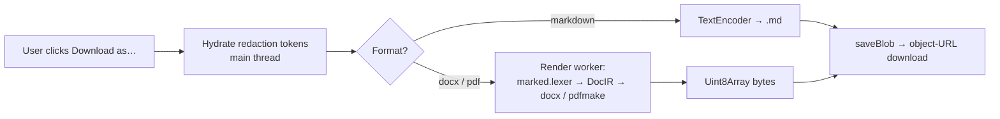

# Document Generation (client-side)

Users can download any assistant message as a real Word document, PDF or
Markdown file. Unlike competitors (server-side Python sandboxes), Cognos
renders the file **in the browser**, from the already-decrypted message
content, inside a Web Worker.

The rule: **a document is a render, not an upload.** File bytes are derived
on demand from the encrypted message source and go straight to the user's
disk. Nothing new is stored; nothing document-shaped transits the network.

Properties this gives us:

- **Zero new server surface.** The backend is untouched — no endpoint, no
  storage, no plaintext. Stronger than image generation, where plaintext
  bytes transit the backend before sealing.
- **Files contain real values, providers never saw them.** Redaction tokens
  are hydrated client-side immediately before render — same posture as
  display.
- **No identifying metadata.** Generated files carry creator/producer
  `Cognos` and day-rounded timestamps only (docx pack-time timestamps are
  rewritten inside the zip — the library offers no override). Anyone the
  user sends the file to learns nothing about them.
- **Renderer performs zero network I/O.** Libraries are lazy-loaded
  same-origin chunks; remote markdown image URLs are dropped (alt text
  kept); links are sanitised to `http(s)`. A generated file can never
  phone home.
- **Fail open to text.** The markdown→DocIR mapper is total — unknown or
  hostile input degrades (HTML stripped, KaTeX/footnotes stay literal),
  never throws. Render failures show a translated notice; the message
  content is always still there.
- **Heavy libraries never touch the initial bundle.** `docx` (~113 KB gz)
  and `pdfmake` (~342 KB gz + fonts) load lazily inside the worker on
  first use.

Authoritative code: `frontend/src/app/documents/` —
`document-export.service.ts` (hydrate → route → deliver),
`markdown/markdown-to-docir.ts` (the total mapper),
`renderers/` (docx/pdf/markdown facades + `doc-styles.ts` metadata
hygiene), `workers/document-render.worker.ts`. Spec:
`docs/specs/document-generation.md` (Phase 1 of 5 — model-created
`<cog-doc>` documents, XLSX and the browser tool loop build on this
same path).
