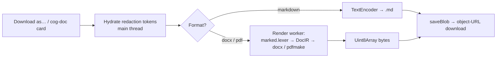

# Document Generation (client-side)

Users can download any assistant message as a real Word document, PDF or
Markdown file — and can ask the model for one ("write me a PDF brief"),
which answers with a **document card** in the reply. Unlike competitors
(server-side Python sandboxes), Cognos renders the file **in the browser**,
from the already-decrypted message content, inside a Web Worker.

The rule: **a document is a render, not an upload.** File bytes are derived
on demand from the encrypted message source and go straight to the user's
disk. Nothing new is stored; nothing document-shaped transits the network.

Two entry points, one render path:

1. **Download as…** in the message toolbar — works on any assistant
   message, retroactively.
2. **Model-created documents** — the composer's "Create documents" tool
   (on by default, per-conversation opt-out) appends a byte-stable
   `<cog-doc>` output contract to the system prompt. The model emits the
   document as a tagged block inside its normal reply; the client shows a
   live card while it streams and renders the file on download. The raw
   block persists inside the sealed message like any other content — the
   card re-renders from history for free.

Properties this gives us:

- **Zero new server surface.** The backend is untouched — no endpoint, no
  storage, no plaintext. Stronger than image generation, where plaintext
  bytes transit the backend before sealing.
- **Files contain real values, providers never saw them.** Redaction tokens
  are hydrated client-side immediately before render — same posture as
  display.
- **No identifying metadata.** Generated files carry creator/producer
  `Cognos` and day-rounded timestamps only (docx pack-time timestamps are
  rewritten inside the zip — the library offers no override). Anyone the
  user sends the file to learns nothing about them.
- **Renderer performs zero network I/O.** Libraries are lazy-loaded
  same-origin chunks; remote markdown image URLs are dropped (alt text
  kept); links are sanitised to `http(s)`. A generated file can never
  phone home.
- **Fail open to text.** The markdown→DocIR mapper is total — unknown or
  hostile input degrades (HTML stripped, KaTeX/footnotes stay literal),
  never throws. A truncated or malformed `<cog-doc>` block degrades to
  visible markdown (plus a translated notice when the spec was invalid);
  render failures show a notice; the message content is always still there.
- **Opt-out means byte-identical.** Turning "Create documents" off removes
  the contract from the system prompt entirely — the wire payload matches a
  pre-feature client, asserted in e2e. Nothing document-shaped leaks when
  the user says no.
- **Citation anchors never guess.** If a reply mixes web-search citations
  with a document block, inline citation markers are suppressed (offsets
  index the unsegmented content) and the sources dropdown carries all
  sources — mirroring the web-search degradation rule.
- **Heavy libraries never touch the initial bundle.** `docx` (~113 KB gz)
  and `pdfmake` (~342 KB gz + fonts) load lazily inside the worker on
  first use.

Authoritative code: `frontend/src/app/documents/` —
`document-export.service.ts` (hydrate → route → deliver),
`markdown/markdown-to-docir.ts` (the total mapper),
`renderers/` (docx/pdf/markdown facades + `doc-styles.ts` metadata
hygiene), `workers/document-render.worker.ts`,
`cog-doc/` (block parser + prompt contract),
`../components/chat/document-card/` (the card). Spec:
`docs/specs/document-generation.md` (Phases 1–2 of 5 shipped — XLSX,
save-to-library and the browser tool loop build on this same path).
