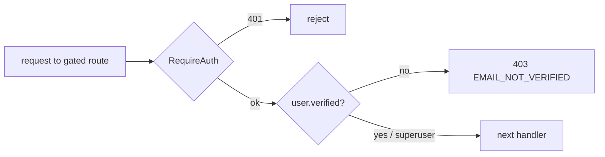

# Email Verification Gate

Registration is open (anyone can create a `users` record), and every new Account
is [seeded Trial credit](./signup-trial-seed.md) on signup. To stop scripted
throwaway Accounts from minting free AI usage at our Provider cost, every
endpoint that spends money with an AI Provider requires a **verified email**.

The gate is the `handler.RequireVerifiedEmail()` middleware, bound **after**
`apis.RequireAuth()` on the AI-consuming routes only. It reads the authenticated
user record's `verified` field, which PocketBase re-resolves per request — so an
Account holder who confirms their email mid-session is unblocked on their **next**
send with no re-login. Superusers bypass the gate.

## What is gated

| Gated (spends provider budget)                      | Not gated (no AI spend)                                              |
| --------------------------------------------------- | -------------------------------------------------------------------- |
| `POST /completions`                                 | Reading conversations & messages                                     |
| `POST /conversations/{id}/complete` · `/regenerate` | All key setup, `vault`, account, billing                             |
| `POST /conversations/{id}/image`                    | Attachment CRUD (AI is only spent once a completion references one)  |
| `POST /images`                                      |                                                                      |
| `POST /conversations/{id}/compactions`              | `/compactions/manual` and compaction edits (store client ciphertext) |
|                                                     | `POST /completions/{id}/stop` (cancels an in-flight call)            |

Chat history and account management are **never** held hostage by verification —
only actions that call a provider are.

## Response shape

An unverified Account holder hitting a gated route gets **HTTP 403** with the same
structured body the billing gate uses, so the client can branch on `error`:

```json
{ "error": "EMAIL_NOT_VERIFIED", "message": "Verify your email address to start chatting.", "next_step": "verify_email" }
```



The frontend maps the 403 to a calm "confirm your email" locked-composer state
with a resend action, rather than a raw error toast.

## Google OAuth

Accounts created via [Google OAuth](./oauth-google-sign-in.md) are marked
`verified = true` by PocketBase when Google returns a verified email. Those
Accounts pass this gate immediately and never see the “confirm your email”
composer lock.

> **Production note:** this gate is only meaningful if SMTP is configured so
> verification emails actually send. In local dev / e2e (no SMTP), mark the Account
> `verified` via the PocketBase admin UI or a superuser — see the README.
