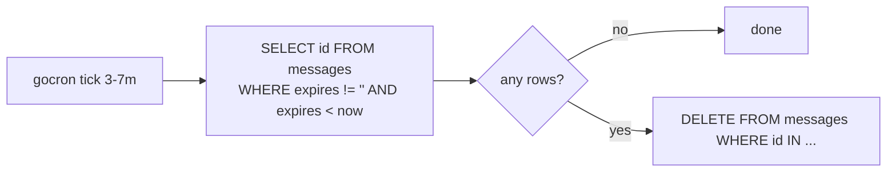

# Expired Message Cleanup

A conversation can be created with an `expiry_duration` of `24h`, `168h`
(7 days), `2160h` (90 days), or `4320h` (180 days). At message-write time,
the chat repo stamps `messages.expires = now + expiry_duration`.

A gocron job runs every **3–7 minutes (random)**, finds `expires < now`
rows, and deletes them in bulk via `DELETE FROM messages WHERE id IN (...)`.

Why jitter: prevents a deterministic deletion wave that would line up with
other periodic load. Why bulk delete: a single SQL statement avoids the
per-record Pocketbase hook overhead — these deletions are not user-driven
and don't need the soft-delete audit copy.

Attachments: deleting a message cascades its `attachment_usages` join rows
(FK `cascadeDelete`), but **not** the `user_attachments` library file — that
relation is intentionally non-cascade, so a file the user uploaded survives the
expiry of any message that referenced it and stays in their library (see
[attachment-processing](./attachment-processing.md)).

The companion job `cleanUpDeletedRecordJob` keeps the
[soft-delete retention](./soft-delete-retention.md) window honest by
removing audit rows older than 30 days.
