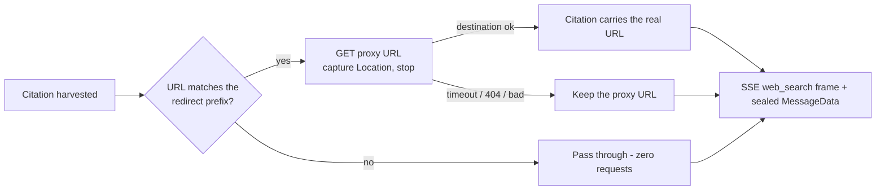

# Grounding-Redirect Resolution

Vertex Gemini web-search citations arrive as Google proxy links
(`vertexaisearch.cloud.google.com/grounding-api-redirect/…`), not real URLs.
Left alone they route every Account holder click through Google **and expire after
~30 days**, rotting the links inside encrypted Conversation history.

The rule: **the backend resolves each proxy link once, per completion, to its
destination URL — before the citation is streamed or sealed — and stores
nothing about the mapping.**

Properties this gives us:

- **Account holder clicks go straight to the publisher.** Google sees a single
  fetch from Cognos's server per source — never the Account holder's IP or which
  source they chose. Better privacy than the raw proxy, and links in history outlive the
  30-day proxy expiry.
- **Google's terms are respected by construction.** No redirect→destination
  mapping is ever cached or stored server-side (their terms forbid building an
  index of Links); the destination page is never fetched (only the redirect's
  `Location` header is read); there is no click tracking. The resolved URL
  lives only in the stream and the Account holder's encrypted Message.
- **No SSRF surface.** Only URLs matching the configured prefix
  (`gateway.grounding_redirect_prefix`, default the real Vertex host) are ever
  fetched — at most 2 hops while still on that host; the first off-host
  `Location` is the destination and is only validated (absolute `http(s)`),
  never requested.
- **Failure is graceful and bounded.** 1.5 s per URL, concurrency 4, 3 s per
  completion; any timeout/expiry/loop keeps the proxy URL. Logs carry
  `resolved_count`/`failed_count` only — never a URL.
- **Other providers cost nothing.** Azure/OpenAI citations are real URLs, miss
  the prefix, and trigger zero requests.

Authoritative code: `backend/internal/gateway/grounding.go`
(`HTTPGroundingResolver`), wired in `backend/internal/gateway/bifrost_client.go`
at citation finalisation. Related: [web-search](./web-search.md); legal
rationale in `docs/specs/web-search.md` (Decision 9).
