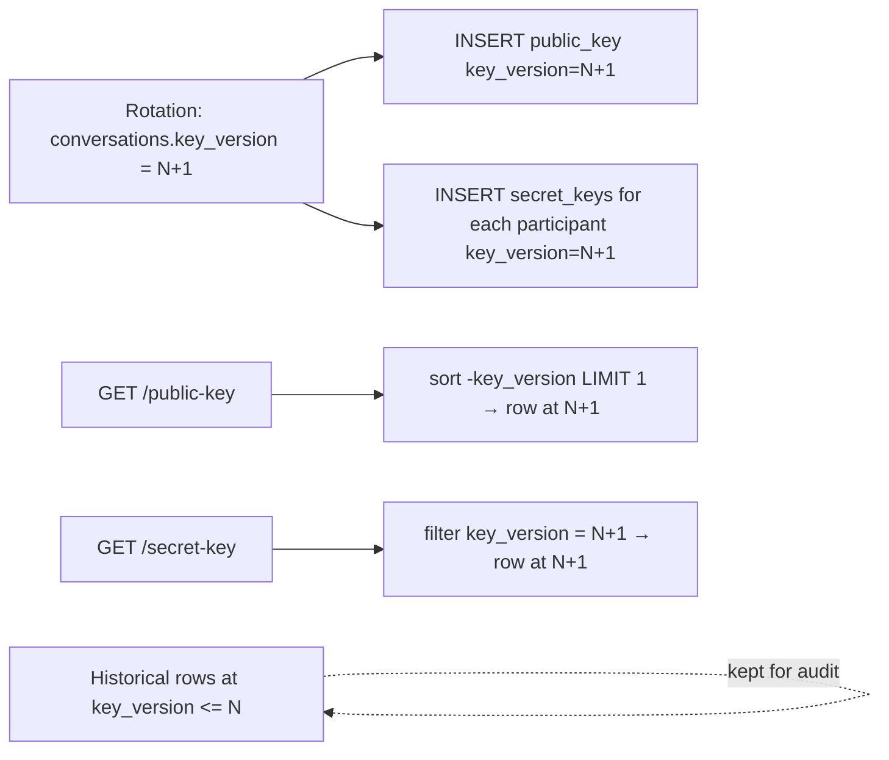

# Key Version Read Gate

Three tables carry a `key_version` column that ties a row to a specific
conversation generation:

| Table                      | Use of `key_version`                                                        |
| -------------------------- | --------------------------------------------------------------------------- |
| `conversations`            | The conversation's **current** generation (starts at 1, bumped by rotation) |
| `conversation_public_keys` | Generation the public key belongs to                                        |
| `conversation_secret_keys` | Generation the wrapped key was produced against                             |

Read endpoints (`GET /conversations/{id}/public-key`,
`GET /conversations/{id}/secret-key`, and the gateway path that loads the
recipient key for encryption) filter by **the conversation's current
generation**. Older rows stay in the DB as audit data but never surface:

- `auth.KeyPairRepo.ConversationPublicKey` sorts by `-key_version LIMIT 1`.
- `ownedConversationSecretKeyRecord` filters by
  `conversation = ? && user = ? && key_version = current`.

Why filter, not delete: a deleted row is a deleted audit trace. A filtered
row is invisible to the API but still answers "what key was in force on
date X?". The cost is one extra column and a slightly more specific query;
the value is that revocation + rotation never loses history.

Legacy rows with `NULL` or `0` are treated as **version 1** so pre-feature
data keeps working — the migration backfill stays an implementation detail.
