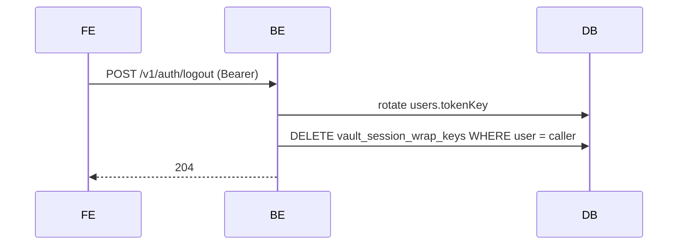

# Logout Token Rotation

`POST /v1/auth/logout` performs two writes on behalf of the caller:

1. **Rotate `tokenKey`** on the user record via `re.Auth.RefreshTokenKey()` +
   `app.Save`. Every Pocketbase auth token signed under the previous tokenKey
   is now invalid, immediately revoking any still-live sessions for that Account holder.
2. **Delete the vault session wrap key** from `vault_session_wrap_keys` so
   the server stops holding the convenience cache that would otherwise let
   the next session re-open the Vault without re-entering the Account Key.

Why both: rotating tokenKey alone would leave the wrap key cached server-side, so a stolen DB
snapshot could still Unlock the Vault for someone with the Account holder's local Vault ciphertext
and a valid auth token to fetch the wrap key. Deleting the wrap key alone would still leave any
exfiltrated bearer token usable. Logout means **both** invariants reset.
