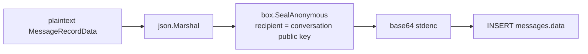

# Message Encryption

Every persisted message row has its `data` column populated with the
**base64 of a NaCl sealed box** of the JSON-encoded `MessageRecordData`,
encrypted against the conversation's current public key
(`box.SealAnonymous`, ephemeral sender keys).

Pipeline (per message):

Properties this gives us:

- **No plaintext at rest.** The server stores only ciphertext bound to the
  conversation's recipient public key.
- **Forward access loss on rotation.** Once
  [conversation-key-rotation](./conversation-key-rotation.md) bumps the
  generation, new messages encrypt against the new public key — revoked
  participants can no longer decrypt them even if they kept the old wrapped
  secret key.
- **No sender keys to manage server-side.** SealAnonymous mints an
  ephemeral keypair per message; only the conversation's secret key
  (held by participants) can decrypt.

Persistence is done by `chat.PocketBaseMessageRepo.EncryptAndPersistMessage`,
called twice per completion (user message before gateway, assistant message
after). If the gateway call fails after the user message lands, the handler
deletes the user message to keep the conversation history clean.

## What lives in the blob vs. plaintext columns

Anything the **server** doesn't need to query goes inside the encrypted
`MessageRecordData` blob, so no extra metadata leaks at rest:

- `created_at` — an RFC 3339 display timestamp set by the backend and encrypted
  into the blob. Message **ordering** uses the `parent_message` linked list, not
  this value. PocketBase still stores its system `created` and `updated` fields
  in plaintext on each row, so the server and a database observer can infer
  Message timing even though the display value is encrypted.
- `expires` — by contrast, stays a **plaintext column**. The expiry-cleanup
  job (`FindExpiredMessages`) has to query it server-side, so it cannot be
  hidden in the blob. It carries only an expiry instant, not a send time.
- `attachments` — references to files on the message live **inside** the blob:
  `user_upload` (kind + library `attachment_id` + display mime) and
  `generated_image` (sealed key + mime). So the message never reveals to the
  server which library file it used; the separate plaintext `attachment_usages`
  join records `(conversation, message, attachment)` for the library's "used in"
  view and the removed-file tombstone (see
  [attachment-processing](./attachment-processing.md)).

`MessageRecordData` (backend `internal/chat/messaging.go`) and the frontend
`MessageData` zod schema must stay in sync — both carry `created_at` as an
optional field so messages written before it existed still decrypt.
