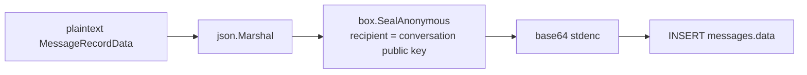

# Message Encryption

Every persisted message row has its `data` column populated with the
**base64 of a NaCl sealed box** of the JSON-encoded `MessageRecordData`,
encrypted against the conversation's current public key
(`box.SealAnonymous`, ephemeral sender keys).

Pipeline (per message):

Properties this gives us:

- **No plaintext at rest.** The server stores only ciphertext bound to the
  conversation's recipient public key.
- **Forward access loss on rotation.** Once
  [conversation-key-rotation](./conversation-key-rotation.md) bumps the
  generation, new messages encrypt against the new public key — revoked
  participants can no longer decrypt them even if they kept the old wrapped
  secret key.
- **No sender keys to manage server-side.** SealAnonymous mints an
  ephemeral keypair per message; only the conversation's secret key
  (held by participants) can decrypt.

Persistence is done by `chat.PocketBaseMessageRepo.EncryptAndPersistMessage`,
called twice per completion (user message before gateway, assistant message
after). If the gateway call fails after the user message lands, the handler
deletes the user message to keep the conversation history clean.
