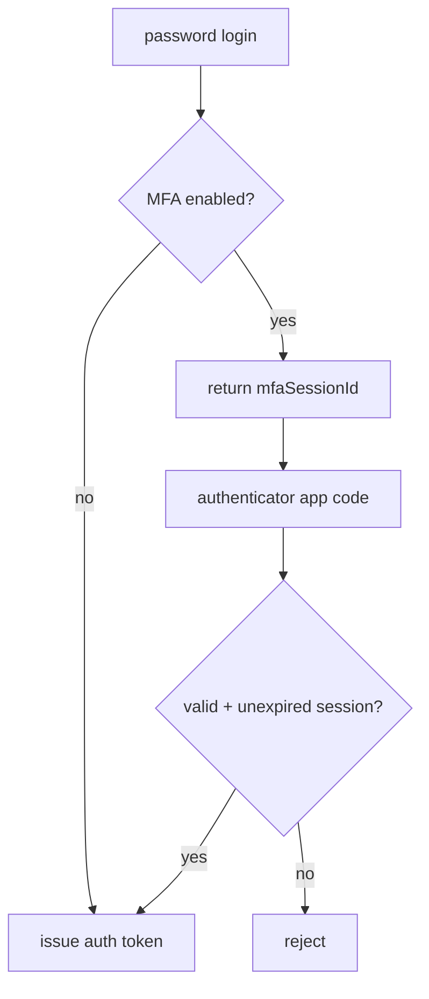

# MFA Login

MFA uses authenticator-app TOTP only. Email OTP is not supported because email
account compromise would defeat it.

When MFA is enabled, login is:

1. User enters email + password.
2. PocketBase validates the password.
3. The backend intercepts the auth response and returns `mfaSessionId` instead
   of an auth token.
4. User enters the 6-digit code from their authenticator app.
5. Backend verifies the code, consumes the session, and issues the normal auth
   token.

MFA protects account access. It does not decrypt chat data. The Account Key (or
trusted-device vault session) is still required after login to open encrypted
content.
