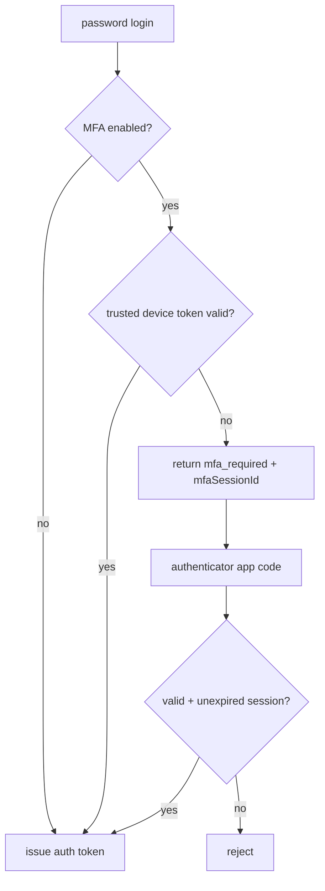

# MFA Login

MFA uses authenticator-app TOTP only. Email OTP is not supported because email
account compromise would defeat it.

When MFA is enabled, login is:

1. Account holder enters email + Account password.
2. PocketBase validates the Account password.
3. The backend intercepts the auth response. If the request carries a valid
   trusted-MFA-device token (see below), it issues the normal auth token and the
   code step is skipped. Otherwise it returns a distinct `mfa_required` response
   carrying `mfaSessionId` instead of an auth token.
4. Account holder enters the 6-digit code from their authenticator app.
5. Backend verifies the code, consumes the session, and issues the normal auth
   token. Repeated bad codes burn the session and trip a per-account cooldown.

## Remember this device

To avoid prompting for a code on every new sign-in, a device that completes a full code challenge
may be remembered. There is no idle auto-logout. On opt-in the
backend issues a trusted-MFA-device token (random secret, stored server-side as a
hash only) that waives the code step for a bounded window (e.g. 30 days).

A trusted-MFA-device token:

- waives **only** the second factor — it never decrypts data; the Account Key (or
  trusted-device vault session) is still required to open encrypted content
- is bound to one Account and expires
- is revoked on logout, MFA disable, recovery-code regeneration, and password
  change
- is independent of the trusted-*vault* device, which stores the data unlock key

MFA protects Account access. It does not decrypt Conversation data. The Account Key
(or trusted-device Vault session) is still required after login to open encrypted
content.
