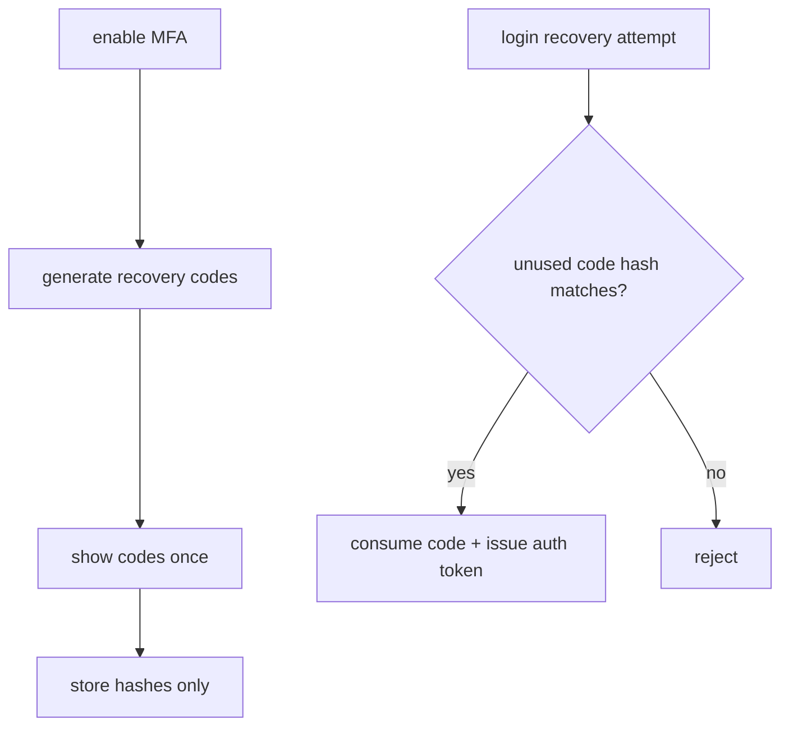

# MFA Recovery Codes

Recovery codes exist because authenticator-app MFA has a real lockout risk.
They are a fallback for losing the authenticator device — not a day-to-day MFA
method.

Process:

1. User enables authenticator-app MFA.
2. Backend generates a small set of high-entropy recovery codes.
3. Codes are shown once to the user.
4. Backend stores only hashes.
5. A used code is immediately marked used and cannot be reused.

Do not email recovery codes. Do not log them. If all codes are lost, account
access may be unrecoverable, but encrypted data is still governed by the Account
Key.
