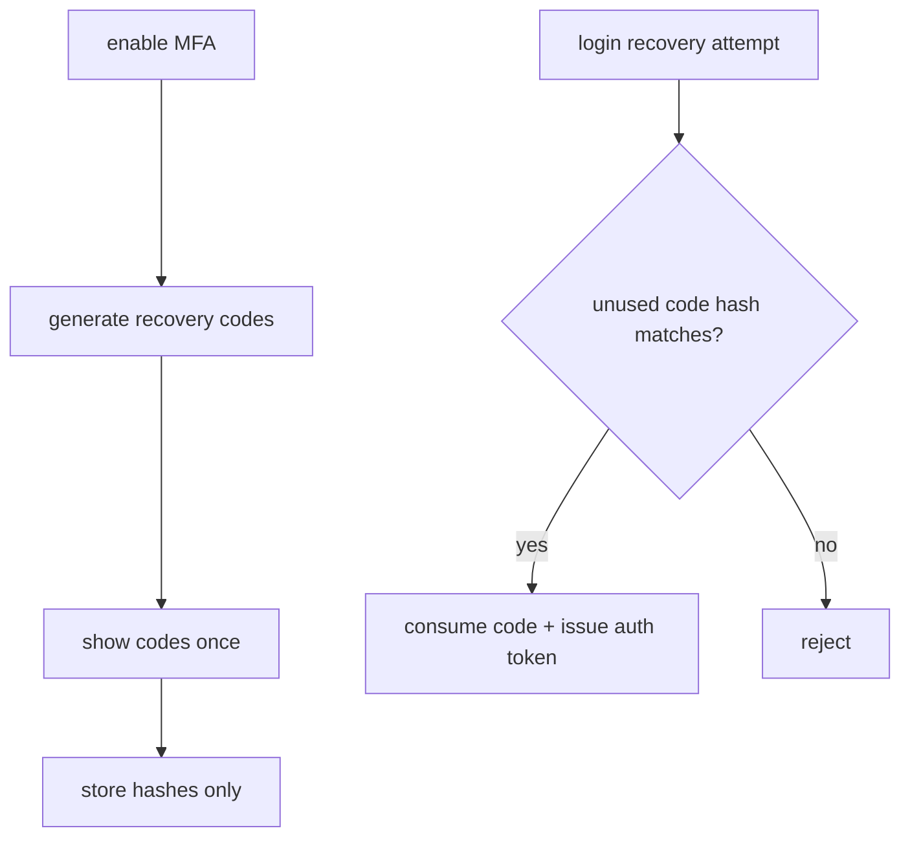

# MFA Recovery Codes

Recovery codes exist because authenticator-app MFA has a real lockout risk.
They are a fallback for losing the authenticator device — not a day-to-day MFA
method.

Process:

1. Account holder enables authenticator-app MFA.
2. Backend generates a fixed set of 10 high-entropy (≥128-bit) MFA recovery codes.
3. Codes are shown once to the Account holder.
4. Backend stores only hashes.
5. A used code is immediately marked used and cannot be reused.

Do not email recovery codes. Do not log them.

Recovery favours security over convenience. A password reset does **not** disable
or recover MFA — the new password still faces the code challenge. There is no
self-service or support MFA reset. If both the authenticator and every recovery code are lost,
Account access is unrecoverable. This is an accepted risk: encrypted data was always governed by
the Account Key, not by MFA.
