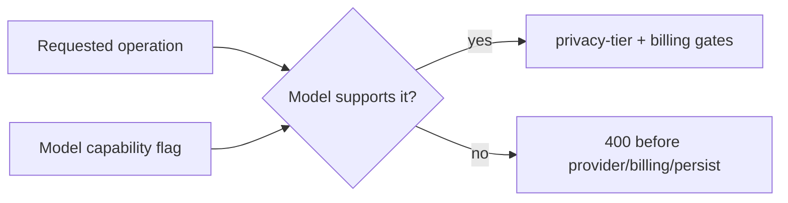

# Model Capability Gating

Each model in the catalogue declares what it can **produce**:

| Capability       | Flag                        | Operation                                 |
| ---------------- | --------------------------- | ----------------------------------------- |
| Text completion  | `supports_text_completion`  | `/completions`, `/…/complete`             |
| Image generation | `supports_image_generation` | `/…/image`                                |
| Web search       | `supports_web_search`       | tool inside `/completions`, `/…/complete` |

These are independent. Most chat models are text-only. The Gemini image model is
**image-only** (`supports_text_completion: false`). A future multimodal model
could be both.

The rule: **a request is rejected before any billing, persistence, or provider
call if the chosen model can't perform that operation.** Same shape as
[privacy-tier-gating](./privacy-tier-gating.md) — capability is just a second
gate alongside tier and billing in the [completion pipeline](./completion-pipeline.md).

Enforced in **two places**:

1. **`GET /api/v1/models`** exposes both flags per model so the composer can
   filter the picker to capable models and switch away from an incapable one
   (see `docs/specs/tool-aware-model-selection.md`).
2. **The handler** re-checks the chosen model and returns `400` if a client
   smuggled in an incapable model ID:
    - text completion + `!supports_text_completion` → "This model can't be used
      for text completion"
    - image generation + `!supports_image_generation` → "Model does not support
      image generation"

**Exception — web search gates differently.** It is a tool _inside_ a text
completion, not the requested operation, so an incapable model gets the tool
**silently dropped** (no `400`) and the completion proceeds. See
[web-search](./web-search.md).

Why it matters: disabling a composer tool used to leave an image-only model
selected and route a normal text prompt to it, which the provider then errored
on (`docs/bugs/2026-06-30-image-only-model-text-completion.md`). The UI flags
drive UX; the handler check is the authoritative gate. Both must agree.

> **Default-safe:** `supports_text_completion` defaults `false` on a new record,
> so a freshly curated image-only model is blocked from text by default. The
> seed migration (`1760000064`) sets it `true` for every existing non-image
> model. A new model that does text must set it explicitly.
