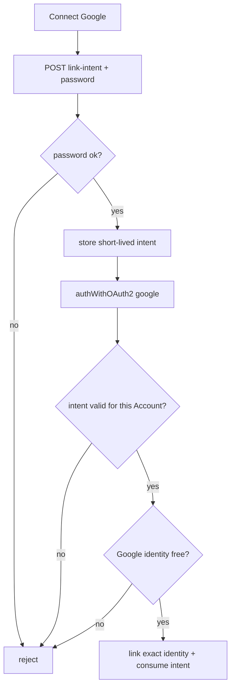

# OAuth Account Link

A **password** Account may connect one Google identity so the holder can later
sign in with either method. Linking is intentional and password-gated. There is
no silent merge when someone uses Google with an email that already belongs to
a password Account.

Only the exact provider name `google` is accepted. The selected Google
provider identity ID, not its email address or display name, becomes the durable
link.

## Link flow (password Account → Google)

1. Account holder is signed in with password (and Cognos MFA if enrolled).
2. In Security settings they choose **Connect Google**.
3. Client calls `POST /api/v1/account/oauth/link-intent` with the current
   Account password.
4. Backend verifies the password and stores a 10-minute, one-time link intent
   bound to that Account and `google`.
5. Client runs Google `authWithOAuth2` while authenticated.
6. Backend requires the valid link intent, rejects a provider name other than
   `google`, rejects a second Google identity on the Account, and rejects an
   identity already linked to another Account.
7. Backend stores the exact Google provider identity ID on `_externalAuths` and
   consumes the intent.
8. `GET /api/v1/account/auth-methods` then reports `hasPassword: true` and
   `providers: ["google"]` (linked).

## Collision (unauthenticated Google, email already taken)

If Google returns an email that already belongs to a password Account and the
caller is **not** completing a valid link intent:

- OAuth must **not** attach Google or issue a token for that Account.
- Response is a distinct error (`ACCOUNT_EXISTS_USE_PASSWORD`) so the UI can say:
  sign in with your password, then connect Google in settings.

If the exact Google provider identity is already linked to another Account,
Cognos rejects the link even when the email differs and the password proof is
valid. An identity is never transferred between Accounts.

## Cancellation, expiry, and disconnect

Closing or blocking the popup, provider failure, or an expired/reused intent
creates no link. The signed-in password session remains active, and the Account
holder may confirm their password again to retry.

Cognos does not currently offer Google disconnect. This prevents a Linked
Account from accidentally removing its alternate sign-in method. A future
disconnect flow must require fresh password proof and must never remove the last
usable sign-in method.

## What must never happen

- Auto-linking Google because emails match.
- Linking without a fresh password proof (bearer token alone is not enough).
- Linking more than one Google identity to an Account.
- Moving a Google identity that is already linked to another Account.
- Accepting a provider name other than `google`.
- Allowing an OAuth-only Account to “set a Cognos password” via this flow
  (out of scope; OAuth-only Accounts stay password-less).

## Enforcement / tests

- Handler and Account-method rules: `backend/cmd/api/oauth_account_test.go`.
- Intent expiry, Account/provider binding, and single use:
  `backend/cmd/api/oauth_store_test.go`.
- OAuth hook collision, exact identity, and link creation:
  `backend/cmd/api/oauth_hook_test.go`.
- Browser settings journey: `e2e/tests/oauth.spec.ts`.
