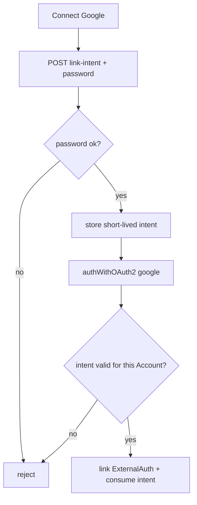

# OAuth Account Link

A **password** Account may connect Google so the holder can later sign in with
either method. Linking is intentional and password-gated. There is no silent
merge when someone uses Google with an email that already belongs to a password
Account.

## Link flow (password Account → Google)

1. Account holder is signed in with password (and Cognos MFA if enrolled).
2. In Security settings they choose **Connect Google**.
3. Client calls `POST /api/v1/account/oauth/link-intent` with the current
   Account password.
4. Backend verifies the password and stores a short-lived, one-time link intent
   for that Account.
5. Client runs Google `authWithOAuth2` while authenticated.
6. Backend allows the Google `_externalAuths` row only when a valid link intent
   exists for the authenticated Account; the intent is consumed.
7. `GET /api/v1/account/auth-methods` then reports `hasPassword: true` and
   `providers: ["google"]` (linked).

## Collision (unauthenticated Google, email already taken)

If Google returns an email that already belongs to a password Account and the
caller is **not** completing a valid link intent:

- OAuth must **not** attach Google or issue a token for that Account.
- Response is a distinct error (`ACCOUNT_EXISTS_USE_PASSWORD`) so the UI can say:
  sign in with your password, then connect Google in settings.

## What must never happen

- Auto-linking Google because emails match.
- Linking without a fresh password proof (bearer token alone is not enough).
- Allowing an OAuth-only Account to “set a Cognos password” via this flow
  (out of scope; OAuth-only Accounts stay password-less).

## Enforcement / tests

- Link-intent wrong password → reject.
- OAuth without intent against existing password email → `ACCOUNT_EXISTS_USE_PASSWORD`.
- OAuth with valid intent → ExternalAuth created; intent not reusable.
