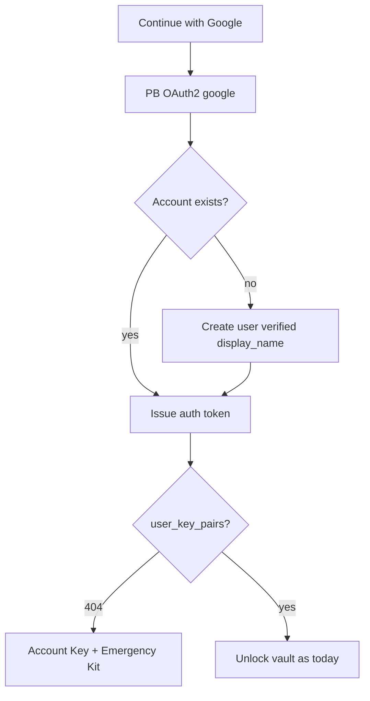

# Google OAuth Sign-In

Account holders may create an Account or sign in with **Google** via PocketBase
OAuth2. Password signup and login remain available.

Google is an authentication provider only. It never receives the Account Key or
decrypted Conversation content. Cognos still never sees the Account Key.

## Signup / first sign-in

1. Account holder chooses **Continue with Google** on login or register.
2. PocketBase completes the Google OAuth2 popup flow
   (`authWithOAuth2({ provider: 'google' })`).
3. If no Account exists for that Google identity / email, PocketBase creates a
   `users` record, marks `verified = true` when Google returns a verified email,
   and maps the Google display name onto `display_name` (Avatar URL is **not**
   mapped — Cognos uses `avatar_icon` / `avatar_color`).
4. The auth token is issued. Cognos MFA is **not** challenged on this path
   (see [MFA login](./mfa-login.md)).
5. The client loads the Account key pair. On **404** (no `user_key_pairs` row),
   the existing vault-init flow runs: generate Account Key, show Emergency Kit,
   create the single key-pair row ([single Account key pair](./single-user-key-pair.md)).

Trial credit is seeded on user create as for password signup
([Signup Trial seed](./signup-trial-seed.md)). Because Google marks the email
verified, the [email verification gate](./email-verification-gate.md) does not
block AI spend for a new Google Account.



## Returning sign-in

Google OAuth for an Account that already has a Google `_externalAuths` link
issues a normal auth token. Vault unlock follows the usual trusted-device /
Account Key rules ([Vault session](./vault-session.md)).

## What must never happen

- Silent merge of Google into an existing **password** Account when the emails
  match. That requires an intentional link with password proof
  ([OAuth account link](./oauth-account-link.md)).
- Storing Google profile photos as Cognos avatars.
- Treating Google sign-in as a substitute for the Account Key.
- Logging OAuth tokens, codes, or Account Keys.

## Account kinds

| Kind          | Sign-in            | Cognos password UI    | Cognos MFA on login         |
| ------------- | ------------------ | --------------------- | --------------------------- |
| Password-only | Email + password   | Shown                 | Challenged when enrolled    |
| OAuth-only    | Google             | Hidden                | Not challenged              |
| Linked        | Password or Google | Shown (password path) | Challenged on password only |

OAuth-only means the Account has a Google external auth and no usable Cognos
password. The client learns this from `GET /api/v1/account/auth-methods`.

## Collection config

```txt
OAuth2.Enabled = true
MappedFields.Name = display_name
MappedFields.AvatarURL = (empty)
MappedFields.Username = (empty)
MappedFields.Id = (empty)
```

Provider client id/secret are configured per environment in PocketBase (not in
git). Redirect URL is PocketBase's `/api/oauth2-redirect`.

## Enforcement / tests

- Collision and create behaviour: OAuth API e2e / Go tables.
- Vault init: existing register/onboarding coverage; OAuth path asserts 404 →
  Emergency Kit.
- MFA skip on OAuth: pin in MFA login tests (`AuthMethod != password`).
