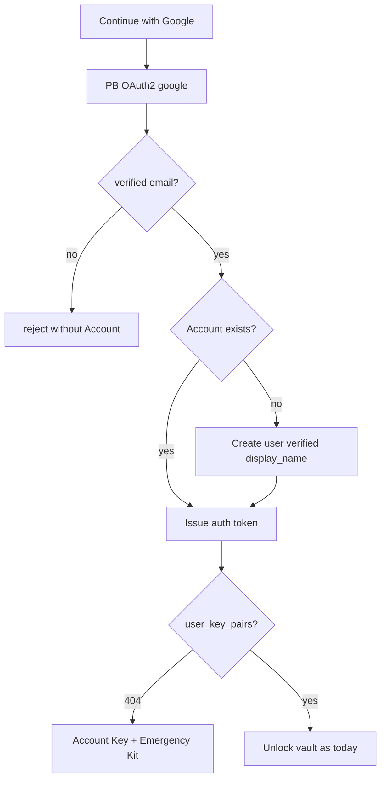

# Google OAuth Sign-In

Account holders may create an Account or sign in with **Google** via PocketBase
OAuth2. Password signup and login remain available.

Google is an **identity provider** only. It never receives the Account Key or
decrypted Conversation content. Cognos still never sees the Account Key.

The only allowed OAuth provider is the exact provider name `google`. Apple,
Microsoft, and every other provider stay rejected until their own business rules,
configuration, and tests ship.

## Signup / first sign-in

1. Account holder chooses **Continue with Google** on login or register.
2. PocketBase completes the Google OAuth2 popup flow
   (`authWithOAuth2({ provider: 'google' })`).
3. PocketBase must return a non-empty, Google-verified email. If it does not,
   Cognos rejects sign-in without creating an Account, issuing a token, or
   seeding Trial credit.
4. If no Account exists for that exact Google identity or verified email,
   PocketBase creates a `users` record, marks `verified = true`, and maps the
   Google display name onto `display_name` (Avatar URL is **not** mapped —
   Cognos uses `avatar_icon` / `avatar_color`).
5. The auth token is issued. Cognos MFA is **not** challenged on this path
   (see [MFA login](./mfa-login.md)).
6. The client loads the Account key pair. On **404** (no `user_key_pairs` row),
   the existing vault-init flow runs: generate Account Key, show Emergency Kit,
   create the single key-pair row ([single Account key pair](./single-user-key-pair.md)).

Trial credit is seeded on user create as for password signup
([Signup Trial seed](./signup-trial-seed.md)). Because Google marks the email
verified, the [email verification gate](./email-verification-gate.md) does not
block AI spend for a new Google Account.



## Returning sign-in

Returning sign-in must match the existing Google `_externalAuths` row by both
provider name (`google`) and Google's stable provider identity ID. An email or
display-name match is not identity proof and must never create another link.

After that exact match, PocketBase issues a normal auth token. Vault unlock
follows the usual trusted-device / Account Key rules
([Vault session](./vault-session.md)).

## Collisions

- If the verified Google email belongs to a password or Linked Account but the
  exact Google identity is not linked, sign-in fails with
  `ACCOUNT_EXISTS_USE_PASSWORD`. The Account holder signs in with their Account
  password, then follows [OAuth account link](./oauth-account-link.md).
- If that exact Google identity is already linked to another Account, Cognos
  rejects sign-in or linking. It never moves the identity between Accounts.
- Closing or blocking the popup, provider failure, or an expired OAuth exchange
  leaves the previous Cognos session unchanged and creates no partial Account or
  link. The Account holder may retry.

## What must never happen

- Silent merge of Google into an existing **password** Account when the emails
  match. That requires an intentional link with password proof
  ([OAuth account link](./oauth-account-link.md)).
- Treating an email match as proof of the Google identity.
- Accepting a provider name other than `google`.
- Storing Google profile photos as Cognos avatars.
- Treating Google sign-in as a substitute for the Account Key.
- Logging OAuth tokens, codes, or Account Keys.

## Account kinds

| Kind          | Sign-in            | Cognos password UI    | Cognos MFA on login         |
| ------------- | ------------------ | --------------------- | --------------------------- |
| Password-only | Email + password   | Shown                 | Challenged when enrolled    |
| OAuth-only    | Google             | Hidden                | Not challenged              |
| Linked        | Password or Google | Shown (password path) | Challenged on password only |

OAuth-only means the Account has a Google external auth and no usable Cognos
password. The client learns this from `GET /api/v1/account/auth-methods`.

Password reset is neutrally suppressed and email change is unavailable for an
OAuth-only Account. See [Password reset](./password-reset.md) and
[Email change](./email-change.md). Linked Accounts use their Account password
for both flows.

## Collection config

```txt
OAuth2.Enabled = true
MappedFields.Name = display_name
MappedFields.AvatarURL = (empty)
MappedFields.Username = (empty)
MappedFields.Id = (empty)
```

Provider client id/secret are configured per environment in PocketBase (not in
git). Redirect URL is PocketBase's `/api/oauth2-redirect`.

## Enforcement / tests

- Provider allowlist and collection mapping:
  `backend/db/migrations/oauth_schema_test.go`,
  `backend/cmd/api/auth_surface_test.go`.
- Account methods, link intent, exact-identity step-up, expiry, and reuse:
  `backend/cmd/api/oauth_account_test.go`,
  `backend/cmd/api/oauth_store_test.go`.
- UI affordances and password-path regression: `e2e/tests/oauth.spec.ts`.
- API account-kind checks: `e2e/tests/oauth-api.spec.ts`.
- Full OAuth-only Account journey: `e2e/tests/persona-elena.spec.ts`
  ([PER-007 Elena Rossi](../personas/07-google-first-account-holder.md)).
- MFA skip: `backend/cmd/api/mfa_login_test.go` pins
  `AuthMethod != "password"`.

The automated persona journey drives PocketBase's real OAuth exchange against a
loopback-only identity provider in `backend/cmd/mock-ai-provider`. It never
contacts Google and cannot be enabled outside dev mode or with a non-loopback
URL.

After adding or changing real Google credentials, complete this manual smoke
before release:

1. Create a new OAuth-only Account; confirm verified email, Trial credit, and
   Emergency Kit.
2. Log out; sign in with the same Google identity and Unlock on a fresh browser.
3. Prove an existing-password email collision does not merge, then connect
   Google with password proof.
4. Cancel the popup and try a different Google identity; confirm no Account,
   link, or delete step-up is created.
5. Delete an OAuth-only test Account only after re-authenticating as its exact
   linked Google identity.
