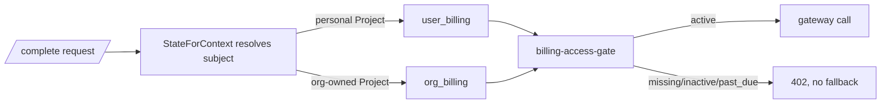

# Organisation Billing

_(Planned — not yet shipped; ships with Teams v1.)_ Every Completion bills
exactly **one** subject, resolved by **Project scope**, not by who is
typing: a personal Project bills the Account's `user_billing`; an
org-owned Project bills its Organisation's `org_billing`. An org member
typing in an org Project never touches their own balance.

## Seat floor + pooled overage

- One Paddle subscription per Organisation. Subscription item quantity = N
  active Seats, each priced at the same **CHF 15.00/seat/month** floor
  individual PAYG uses (see
  [usage-cost-calculation](./usage-cost-calculation.md)).
- Usage from every member's Completions in org Projects pools into one
  ledger. At cycle close: `overage = max(0, total org usage − N × CHF 15)`,
  billed once via the existing CHF 0.01-unit quantity trick — **not** a
  per-seat floor.
- `balance_transactions` rows keep `user_id` for audit and per-member usage
  display, but settlement happens at the Organisation, never the individual.
- No org trial. Members keep any personal trial on their own Account;
  design partners get manual Paddle adjustments instead of a trial plan.

## Fail closed, never fall back

If org billing is missing, `inactive`, or `past_due`, a Completion in that
Organisation's Project is blocked with `402` — the same shape as the
[billing-access-gate](./billing-access-gate.md) — and the request is
**never** retried against the typing member's personal balance. Silently
charging an individual for org usage would break the cost attribution the
org Admin dashboard promises, and would bill someone for spend they never
agreed to.

## Seat changes and lapses

- **Seat add** (new member accepted): Paddle's native proration bills the
  difference immediately.
- **Seat remove** (member offboarded): quantity drops at the **next**
  cycle, no mid-cycle refund. See
  [org-seat-management](./org-seat-management.md) for the full offboarding
  sequence.
- Org creation runs Paddle checkout at quantity 1 with the Owner as the
  first seat; the Organisation has no billing — and therefore no working
  Projects — until that checkout completes.
- A lapsed subscription (`canceled`, or unresolved `past_due`) makes every
  org-owned Project **read-only** for all members until it's reactivated;
  see [org-project-access](./org-project-access.md).
