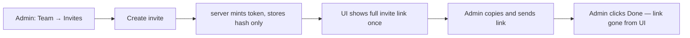
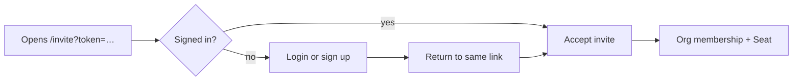

# Organisation Invite Link

**TL;DR:** Settings → Team → Invites → **Create invite** → copy the link → send it to your
colleague. The link is shown **once**. After **Done**, it cannot be retrieved — revoke and
re-issue if needed.

Invitations are link-based, not “type an email and we add them”. That avoids leaking whether
someone already has a Cognos **Account** (enumeration). v1 sends no email — the Admin shares
the link themselves (Slack, email, whatever).

## Admin: mint and share

After **Create invite**:

1. Success callout — link created, copy it now.
2. One-line instruction — colleague signs in (or creates an **Account**) and opens the link.
3. Read-only field — full URL, e.g. `https://app.cognos.io/invite?token=…` (origin + path +
   URL-encoded token).
4. **Copy** — puts the full URL on the clipboard, not the raw token alone.
5. **Done** — dismisses the panel; the token never appears again (only its hash is stored).

Optional **Email address** on the form is for your records only (pending list label). Leave it
blank for a generic “link invite” anyone can use.

| What admins see        | What the server keeps        |
| ---------------------- | ---------------------------- |
| Full invite link once  | SHA-256 hash of the token    |
| Pending list (no link) | Expiry, role, optional email |

## Invitee: open the link

- The link lands on `/invite?token=…` (auth required). Signed-out users hit login with
  `?next=` preserved, then return to the same link.
- Accepting binds the invite to the **signed-in Account** — same **Account**, no second identity,
  no re-**Unlock** ceremony (see [org-seat-management](./org-seat-management.md) for Seats and
  key wrapping).
- Expired, revoked, or already-used links show neutral copy plus a paste-and-retry field.

## Rules (pin these)

- **Single-use.** Second accept → 404 (same as unknown token).
- **Shown once.** List pending invites never includes the token or link.
- **14-day expiry** from mint (server-side).
- **Enumeration-safe.** Create response does not confirm whether an optional email has an
  **Account**.

## Related

- Seats, offboarding, key wrap: [org-seat-management](./org-seat-management.md)
- Project access: [org-project-access](./org-project-access.md)
- Permissions: [API permissions](../api-permissions.md)
