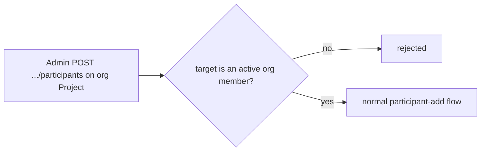

# Organisation Project Access

_(Planned — not yet shipped; ships with Teams v1.)_ An org-owned Project's
participant list is a **subset** of the
Organisation's active members — never a separate list. The rule is
enforced at write time: adding a participant to an org-owned Project
checks Organisation Membership first.

- **Org Admins are automatically Project Admin** on every org-owned
  Project in that Organisation — enforced in the auth layer at request
  time, not stored as a redundant participant row.
- **Org lapse locks content, not metadata.** If the Organisation's billing
  lapses (see [org-billing](./org-billing.md)), every org-owned Project
  becomes read-only for all members — no new Messages, no edits — until
  billing is reactivated.
- **Admins see usage, never content.** The org Admin dashboard shows
  seats, per-member usage and cost, model mix, and cycle spend. It never
  shows Message content, Conversation titles, or memory — the server
  never holds the content keys that would make that possible.

This composes with
[participant-access-control](./participant-access-control.md) and
[participant-add](./participant-add.md): those rules still apply inside an
org-owned Project; this doc only adds the org-membership precondition on
top.
