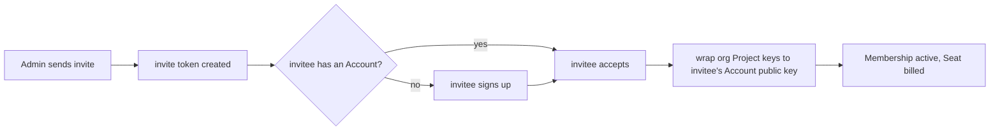

# Organisation Seat Management

_(Planned — not yet shipped; ships with Teams v1.)_ An Organisation
Membership has exactly one role — **Owner**, **Admin**, or **Member** —
and every _active_ Membership occupies exactly one billed **Seat**. Owner:
billing + dissolution. Admin: members, Seats, policy, and the
metadata-only usage dashboard. Member: works in the Organisation's
Projects.

## Invite by token

Invitations are token-based, not a direct "add by email", because the
invitee may not have a Cognos Account yet, and a direct lookup would leak
whether an email is already registered (enumeration).

The crypto step only happens once the invitee is known and has accepted:
the Admin's client seals each org Project's content key to the invitee's
Account public key (`UserPublicKey(userID)`) — the same per-Participant
wrapping every Project already uses. There is no separate org root key.

## Offboarding

Order matters — access is always cut **before** billing catches up:

1. Revoke the Organisation Membership.
2. Revoke the person's participant row on every org-owned Project, then run
   a forward-only Project key rotation so they cannot decrypt anything
   encrypted after removal.
3. Seat count decrements at the **next** billing cycle — no mid-cycle
   refund (see [org-billing](./org-billing.md)).

The departed person's personal Account, personal Projects, and personal
data are completely untouched — offboarding only ever removes _org_ access.
