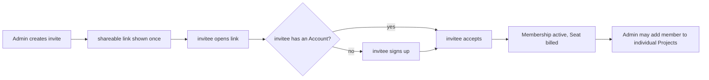

# Organisation Seat Management

An Organisation Membership has exactly one role — **Owner**, **Admin**, or **Member** —
and every _active_ Membership occupies exactly one billed **Seat**. Owner:
billing + dissolution. Admin: members, Seats, policy, and the
metadata-only usage dashboard. Member: works in the Organisation's
Projects.

## Invite by link

Invitations use a single-use link (`/invite?token=…`), not a direct "add
by email", because the invitee may not have a Cognos **Account** yet, and
a direct lookup would leak whether an email is already registered
(enumeration). The Admin copies the full URL from **Team → Invites** — see
[org-invite-link](./org-invite-link.md) for the mint → share → accept UI
flow.

Accepting an invite creates or reactivates the Organisation Membership and updates the Seat
quantity. It does **not** grant access to every Organisation Project. An Admin separately adds the
member to each Project and supplies that member's client-wrapped Project key. There is no separate
Organisation root key.

## Offboarding

Order matters — access is always cut **before** billing catches up:

1. Revoke the Organisation Membership.
2. Revoke the person's Project participation and set `rotation_pending` on affected Projects.
3. An Admin client completes forward-only Project key rotation before writes resume, so the former
   member cannot decrypt anything encrypted after removal.
4. Set `pending_seat_quantity = max(remaining active members, 3)` for the
   **next** billing cycle — no mid-cycle refund (see
   [org-billing](./org-billing.md)). Billing never schedules fewer than three
   Seats.

The departed person's personal Account, personal Projects, and personal
data are completely untouched — offboarding only ever removes _org_ access.
