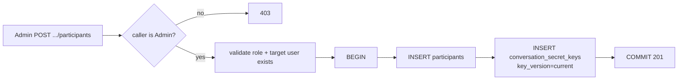

# Add Participant (Share)

`POST /api/v1/conversations/{id}/participants` is the **sharing primitive**.
The caller must already be an `Admin` of the conversation; anyone else gets
`403 Only conversation admins can add participants`.

Body:

```json
{
  "user_id": "...",
  "role": "Admin|Editor|Viewer",
  "wrapped_secret_key": "<conversation secret key wrapped for target user>"
}
```

The handler writes **two** rows in a single transaction:

1. `participants` — `(conversation, user, role, added_at)`
2. `conversation_secret_keys` — the wrapped key for the new participant,
   stamped with the conversation's current `key_version`



Why transactional: a partial failure must never leave the target with a
participant row but no readable key (or, worse, the inverse — a wrapped
key with no membership).

Constraints enforced inline:

- `user_id != caller.id` — the Admin cannot re-add themselves.
- Target Account must exist in `users` (`user_id` in the API body).
- Role must be one of `Admin / Editor / Viewer`.
