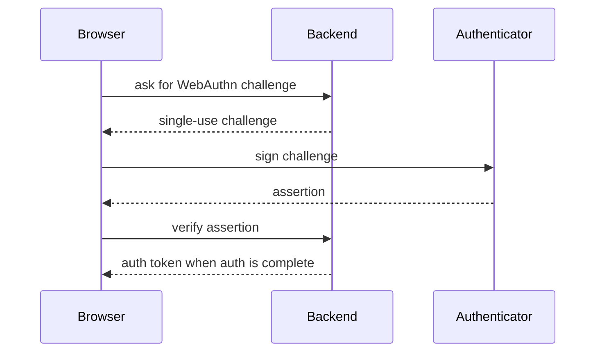

# Passkey Authentication

Passkeys are separate from authenticator-app MFA. They add phishing-resistant
authentication and can later complete MFA sessions or become a first factor if
we explicitly choose that product behaviour.

A passkey stores a **public credential** on the server. The private key stays in
the Account holder's authenticator (iCloud Keychain, 1Password, hardware key, etc.).

Rules:

- Challenges expire quickly and are single-use.
- Origin and RP ID must match the Cognos app host.
- Deleted or disabled credentials cannot authenticate.
- Credential IDs and assertions are auth material; do not log them.
- Passkeys do **not** unlock encrypted Conversations. The Account Key remains the
  data recovery/Unlock secret.

Fresh-device flow is therefore still: authenticate the Account, then Unlock the
Vault with the Account Key.
