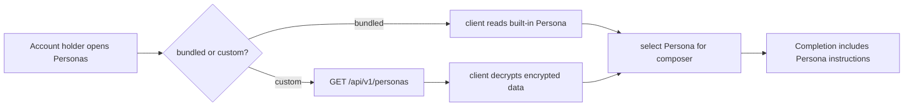

# Persona Management

A **Persona** is a named set of instructions that shapes a Completion. It is not
an autonomous agent and does not run outside the active Completion request.

Cognos ships bundled Personas in the client. Custom Personas belong to one
Account and are encrypted at rest.

Custom Persona endpoints:

| Method   | Path                       | Behaviour                              |
| -------- | -------------------------- | -------------------------------------- |
| `GET`    | `/api/v1/personas`         | List custom Personas owned by Account  |
| `POST`   | `/api/v1/personas`         | Create encrypted custom Persona        |
| `PATCH`  | `/api/v1/personas/{id}`    | Update encrypted custom Persona        |
| `DELETE` | `/api/v1/personas/{id}`    | Delete custom Persona                  |

The server authorises by owner and stores only encrypted Persona data. The
selected default Persona is kept in encrypted Account preferences, so the choice
can follow the Account across devices after the Vault is unlocked.

If a selected Persona is deleted or cannot be decrypted, the composer falls back
to no Persona rather than blocking chat.
