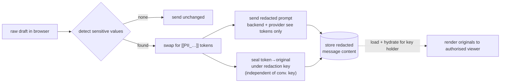

# PII Redaction

Before a prompt ever leaves the browser, Cognos scans the text for common
high-confidence sensitive values — IBANs, emails, phone numbers, credit cards,
API/private keys, and national IDs (Swiss AHV, UK NINo, German Steuer-IdNr, and
friends) — and replaces each one with a **placeholder token** like
`[[PII_IBAN_Q7K9M2]]`. The backend and the AI provider only ever see the
placeholder; the original value is stored in a **separate encrypted mapping** the
server cannot read. See `docs/specs/pii-redaction.md` for the full detector list
and `docs/security-model.md` §14/§16 for the trust-model rationale.

This is a **data-minimisation layer on top of** the encryption model, not a
replacement for it. Detection is best-effort and tuned for precision (it favours
missing a value over corrupting normal prose), so it is not a guarantee that
every sensitive value is caught.

## The rule

- **Redact before send.** Detection and token substitution happen in the browser
  before the completion request is built — for normal send, title generation,
  edited-message forks, regeneration context, temporary chats, and the text
  extracted from attachments.
- **Tokens are model-safe and non-reversible.** Format `[[PII_<TYPE>_<RANDOM>]]`;
  the random suffix comes from Web Crypto and is **never** derived from the
  original value (no reversible encoding, no deterministic hash). The same
  normalised value maps to one token within a conversation.
- **Originals live only in the sealed mapping.** A token→original entry is sealed
  to a **redaction key that is independent of the conversation key** — so handing
  out the conversation key (a normal share) never grants the ability to
  un-redact. The server stores only the plaintext token string plus the sealed
  original; it can associate a token with a conversation/user/project but cannot
  read the value.
- **Hydration is display-only.** A viewer who holds the redaction key sees the
  originals restored at render time; stored message content stays redacted.
  Unknown tokens render as-is.
- **Never logged.** Raw detected values and decrypted mappings never go to
  console, backend logs, analytics, or billing events.

## What the server / provider can and cannot see

| Party        | Sees                                                    | Never sees                                                              |
| ------------ | ------------------------------------------------------- | ----------------------------------------------------------------------- |
| AI provider  | placeholder tokens in the prompt                        | the original sensitive value                                            |
| Backend      | redacted message content, the plaintext token string    | the original value (sealed under redaction key)                         |
| Public share | redacted content by default (placeholders stay as bars) | originals — unless it is an explicit **include-sensitive-values** share |

## Storage & lock-down

Mappings and keys live in dedicated collections
(`conversation_redaction_keys`, `redaction_entries`, and the scoped
`user_redaction_entries` / `project_redaction_*` stores). All have **`null`
PocketBase API rules**; every read/write flows through `/api/v1` handlers that
authorise by active conversation participation (or user/project ownership), and
the lock-down is pinned by a test. Deleting a conversation cascade-deletes its
redaction keys and entries.

## Sharing modes

Public sharing reuses the fragment-gated link model. **Redacted-only** (the
default) carries the conversation key only, so sensitive values stay as
censorship bars and the public redaction endpoint returns `404`.
**Include-sensitive-values** (explicit opt-in) additionally gates the redaction
secret through the URL fragment — the server never holds anything that can
un-redact on its own. Switching modes mints a new token and URL; revoking a
share `404`s both.

## Known limitation

The redaction secret is currently wrapped for the **creating** participant/member
only, so other participants see placeholders until participant-add re-wrapping
lands. This is a coverage limit, not a leak: no one ever receives a value they
should not, and provider exposure is unaffected. Redaction-key rotation is
coupled to [conversation-key-rotation](./conversation-key-rotation.md) and
inherits its limitation (rewraps forward, does not re-seal historical entries).
